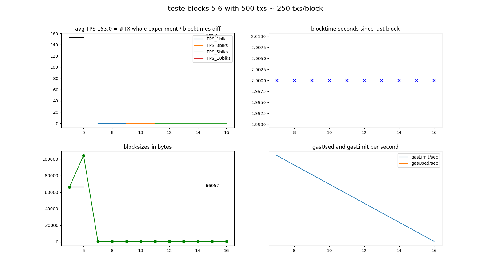

## (teste) Geth v1.8.14 with 500 txs: 153.0 TPS

### information:
```
NODE: Geth/v1.8.14-stable-316fc7ec/linux-amd64/go1.10.3 on http://localhost:8545
      consensus=clique chain_name=??? chain_id=326432352 network_id=500
SEND: 500 transactions in blocks 5-6 with 10 empty blocks following.
      A sample of transactions looked as if they: failed (at least partially).
TPS:  The stopclock watcher measured a final TPS of 74.7 since contract deploy,
      and in between saw values as high as 63.1 TPS.
DIAG: The whole experiment was prefixed 'teste'.
      The diagrams were saved into 'img/teste-20200729-1955_blks5-6.png'.
      Looking only at the experiment block-timestamps, the overall TPS was ~153.0.

```

### log:
```
versions: web3 4.8.2, py-solc: 3.2.0, solc 0.4.25+commit.59dbf8f1.Linux.gpp, testrpc 1.3.5, python 3.5.3 (default, Jul  9 2020, 13:00:10) [GCC 6.3.0 20170516]
web3 connection established, blockNumber = 0, node version string =  Geth/v1.8.14-stable-316fc7ec/linux-amd64/go1.10.3
first account of node is 0x8Cc5A1a0802DB41DB826C2FcB72423744338DcB0, balance is 904625697166532776746648320380374280103671755200316906558.262375061821325312 Ether
nodeName: Geth, nodeType: Geth, nodeVersion: v1.8.14-stable-316fc7ec, consensus: clique, network: 500, chainName: ???, chainId: 326432352

Block  0  - waiting for something to happen
(filedate 1596052353) last contract address: 0xc305c901078781C232A2a521C2aF7980f8385ee9
(filedate 1596052515) new contract address: 0x06FFE7da847332d2B5E8A738db23aEF949b8Fbf2

blocknumber_start_here = 3
starting timer, at block 3 which has  1  transactions; at epochtime 1596052515.1357307
block 4 | new #TX   0 / 2000 ms =   0.0 TPS_current | total: #TX    1 /  2.3 s =   0.4 TPS_average (peak  is   0.4 TPS_average)
block 5 | new #TX 194 / 2000 ms =  97.0 TPS_current | total: #TX  195 /  4.2 s =  46.8 TPS_average (peak  is  46.8 TPS_average)
block 6 | new #TX 306 / 2000 ms = 153.0 TPS_current | total: #TX  501 /  6.7 s =  74.7 TPS_average (peak  is  74.7 TPS_average)
block 7 | new #TX   0 / 2000 ms =   0.0 TPS_current | total: #TX  501 /  7.9 s =  63.1 TPS_average (peak  is  63.1 TPS_average)
block 8 | new #TX   0 / 2000 ms =   0.0 TPS_current | total: #TX  501 / 10.1 s =  49.7 TPS_average (peak was  63.1 TPS_average)
block 9 | new #TX   0 / 2000 ms =   0.0 TPS_current | total: #TX  501 / 11.9 s =  42.1 TPS_average (peak was  63.1 TPS_average)
block 10 | new #TX   0 / 2000 ms =   0.0 TPS_current | total: #TX  501 / 14.0 s =  35.7 TPS_average (peak was  63.1 TPS_average)
block 11 | new #TX   0 / 2000 ms =   0.0 TPS_current | total: #TX  501 / 16.2 s =  31.0 TPS_average (peak was  63.1 TPS_average)
block 12 | new #TX   0 / 2000 ms =   0.0 TPS_current | total: #TX  501 / 18.0 s =  27.8 TPS_average (peak was  63.1 TPS_average)
block 13 | new #TX   0 / 2000 ms =   0.0 TPS_current | total: #TX  501 / 20.1 s =  24.9 TPS_average (peak was  63.1 TPS_average)
block 14 | new #TX   0 / 2000 ms =   0.0 TPS_current | total: #TX  501 / 22.0 s =  22.8 TPS_average (peak was  63.1 TPS_average)
block 15 | new #TX   0 / 2000 ms =   0.0 TPS_current | total: #TX  501 / 24.1 s =  20.8 TPS_average (peak was  63.1 TPS_average)
block 16 | new #TX   0 / 2000 ms =   0.0 TPS_current | total: #TX  501 / 26.0 s =  19.3 TPS_average (peak was  63.1 TPS_average)
Received signal from send.py = updated INFOFILE.
Experiment ended! Current blocknumber = 16
Updated info file: last-experiment.json THE END.
```

### diagrams:


### info raw:
{'blocks_size': {'10': 607,
                 '11': 607,
                 '12': 607,
                 '13': 607,
                 '14': 607,
                 '15': 607,
                 '16': 607,
                 '4': 607,
                 '5': 66057,
                 '6': 104287,
                 '7': 607,
                 '8': 607,
                 '9': 607},
 'blocks_txs': {'10': {},
                '11': {},
                '12': {},
                '13': {},
                '14': {},
                '15': {},
                '16': {},
                '4': {},
                '5': {'0': '0x90a53a201f66c023174f26599e3443a41400d0dbe20bd8b0d874c71c0053b21c',
                      '1': '0x1cc9dfd36b50f62ba35bc4a6d98424d1e90a5a3dd0a59cc49377364f195a091f',
                      '10': '0x5987a48e383a20a14dd509289cececef900c458b019048a68e51163aa1e82d72',
                      '100': '0xf5f4555fe35444ece65e0082cf83f1a6e3f63fd1ada275f68fdc113e14a55ce7',
                      '101': '0xc2abef9ee62a8d9c96f48ca6df53c48b41ba3b172a2c8bd08d2558d0277f6159',
                      '102': '0xca48dd6846d7cfd874415fc1f1488faf6dbf33961114d14e795f3b2511b8ab7f',
                      '103': '0x7ce3860a2377066f38e32c2169c13713efa63c73847460ff9be8283312ae5083',
                      '104': '0xc18d2e636fdcde1c808f04e58d8a2bd35642568a4937c1d5097765da05153c5a',
                      '105': '0x567d995d6231ca18db7280e6197e32436265b366145aa98517cbaaf723d82369',
                      '106': '0xfd7609ab04b1c42547ee6b45cb75e5375f1d15afb8021c9e2d15b0580257f51b',
                      '107': '0xfb441070a17ff760a5712b0eba61968269f440f4c1438b2e48df5cd9f42376d3',
                      '108': '0x5bc2ca851b150106a89ba15bc33e2d3a69a2973476e532d9d64bbfb498b0678f',
                      '109': '0xf4d21b6470e3c3641d2b9d8f476e9d6da838417b7958b3820e39a3db1c5ce3b1',
                      '11': '0xcc60313e127fe420bb6f480dad2d12cb483d63dc81d03b7e9c4160134319a98d',
                      '110': '0x33e64a75eb07f5337906375d426bdc041fb8e57c39a3868c341c1dc6f72923ca',
                      '111': '0x7db97ee59d78204ca9579d01543d91fa4d792055f2477f91f1f801c27799dd15',
                      '112': '0x413119442570f29dd061bcf3e359af3f2dd3f582f4138508a6d422e7452f4aa7',
                      '113': '0x4391a6141cfce0334bfe0f112b1c8084d010a63410938b36c046dc563553fcc7',
                      '114': '0xeff84cec9feac2926ef533e5bbf52f220db909772717abdbf92e0c4d63a6d424',
                      '115': '0xca83d9b7a67eab87879732f884abeebb596a5495aebba382c1280d0eaf256547',
                      '116': '0xee358dbad4bf37e4631ecaedfdefb5b66ae288cf03a39eeec64a216be2d13183',
                      '117': '0xbd0cecc7ff1f05b01c1a9bcb8309d89eb2c9f1c20996d566b23d7b1e40d7a2db',
                      '118': '0x75e3b927cc340281f37c3f3fedd48301c12ab3db70ae203f9259a06fe4e5cc5d',
                      '119': '0xc56a2db91afe48033872a79a5e5da50ec49078497b9cc7fd9de7ca66cdecbbf0',
                      '12': '0x3f112a6b1ffa36e594e0e2a3c48a3763110fba40d13150bc8aa21057746dbbee',
                      '120': '0x6ba090026989f2c7a169001992e1dad611061495243cafeedefb4ba34a2dd952',
                      '121': '0x61107e8155a23c7793272c6751b3fcd0a0e118f08136fa161633f4292c009126',
                      '122': '0xcb696b3c0e826bc8cad5b1b4e9f973f5c8c92ec6cfb969e27469294e74fbc303',
                      '123': '0xfa80953e12b814769d7ef9a5c1c8dbc53529bdbacc7da5a65ceda945c9f77fee',
                      '124': '0xec15b4ac04134aee72759c4fe7b9458bc22860ebd7ff96650b600943c5e6c0da',
                      '125': '0xa1ea85b3697f4371452f3984abbf78dfe059bf66a584e7bd8051a60e59714914',
                      '126': '0x485661b6759e59e806df94264fdeb4fcceb547456510ce0403ca194fbb06943f',
                      '127': '0x53db653b0de2125c830b02433b78ce56b068a376b89cf52f3bd23ac20b37f9cb',
                      '128': '0xc4c5766ae18f530762e993883e35ed5ba504dfaeb7e0ad57e97ca7f622ce3d1a',
                      '129': '0x1d2405ca4fc6e55d380c620fa1285ee550458b8b9e1f1f1e284ca19499aed208',
                      '13': '0x4ae09dcafec509560e08c11513f46dbe08e6fe09962818e3fd244db1034d4c24',
                      '130': '0xfc011ae6a1a1d3f0bfbb71d3be5efa39e84b954525a93f82f899826e443bed27',
                      '131': '0xcd3f34d679ed1db7a529402f65dbf589b950d20d063239dd6ce75f23c3db892c',
                      '132': '0xf7dd3ff0faac4e20809cb1ea910b653b6075b1cac44b5d1af0e663857d9e0ac5',
                      '133': '0x6d13db90566388731826b03078e2ad859ccbfd11ddeec52530048f20559cee8f',
                      '134': '0xab23010d1f60f5e9f7ae844b758c413f6a95935fac4a7580aeb80fbd161fa2d1',
                      '135': '0xb3d516a5698a46a45dcfb2d86934accf83bf556dd5c95e50370acdf8f04ab881',
                      '136': '0x06f5bf8222d0420d43d042cb114563d5a566dfaa9ce89b3066d2a8803f08a731',
                      '137': '0x4888a97d83121406c5380b623abd191afdd884e804abac3862eef12328c0fe02',
                      '138': '0x3756b3cb8ecb6f52a3c2d685f60a1d2823e3dac4292d424d0f8dffb74589a4c0',
                      '139': '0xe2b84bbd54785b8b7d8635cd5e5237a511603f602fb376db34835f43374c897c',
                      '14': '0xc93e6b778b528510b323559cb07e28e80cf0973a9041b098a6cb6bccd1e81bfd',
                      '140': '0xba687215e264cc82e04a662a53b5ab531789066699c62c20fd6aaac5ce656250',
                      '141': '0xa5d66013337fe16c71a30f16156e46a24f2ccf76318e74ef455a47c1f3f7cf51',
                      '142': '0xc416b68c50a526973e41dde9e5a1418aab017730047a688fbda3487e22dae458',
                      '143': '0x28f9b002133be92943c746946ed2ca464276d3b13ee601fc36a62439d2c42336',
                      '144': '0xcb5592e8e5e817d52ac12cef95eb20ce82948f945794279a686df2d4f0162ae9',
                      '145': '0x39642e7d4c7495e56e2b671bf0eec453b4da2290b456eacfe3f2a6c7b1e12f09',
                      '146': '0xdc6a2003796d8025cba687171f03ae2ede3adcf86db2fb7d8ca0bed3622293ef',
                      '147': '0x3f26ac06aa7db778f8ff3431c2b0c9b6aa0428fc990e7f77c55de37716601731',
                      '148': '0x8b59a7fe6420a068f1271f98227a770a8258c3cc0ac2467f6bbd532f14c2a5c2',
                      '149': '0xe8164a545a61ec51165c4bec6b93b93420111d09e286ebad9e6653076840341a',
                      '15': '0x83f55d83dbf6f204d33208bded672a369195f10a7dd541b36be492371eed085a',
                      '150': '0x7fdf99caef4f9ee518d26c095c3e22fe094be365ac72c54423bde75767f97995',
                      '151': '0xe7c0b5d60ebb031e66a0dd2facec916058541a181461e57983bcbf33d39c8a07',
                      '152': '0xc5dd7f50d4acc81f78dbd3060c16a69e406bc6e023827c68cd21fbd3be197244',
                      '153': '0x6219268b6d1fdf8e4319858f862fbb789cfaf289179935caa14a4914bb97a261',
                      '154': '0xc62ab1589c4ebb2ee0311a6a3d722819244f0591bdf048360a31637da55931d1',
                      '155': '0xacce84a6afa45cdd7ab1333b80afbefde483a1281882096b321bc567d6354235',
                      '156': '0xdfd1b1fed7e8f51913c1687c54f223c1d49f42711a9d384d6d6eb51988d8310a',
                      '157': '0xfedd927f4a3f8b7b7ad12d6d9101f7bfccef61ce133c696d9932f3b2cbc255a9',
                      '158': '0x00a5898d4bba501a7d3b96ce2c66d5120ff624368e9a21da181be2025e2093c5',
                      '159': '0x83c9571e1e941b65c055725439f0f2cbf7c4fbe152fa6a5b9a38c8072b01f5f4',
                      '16': '0x1ee9061421e10d31b83e4c6cfb2d0f08d927a55689f1cf532875f4924d26e578',
                      '160': '0xefe6e639f6ec44f43ae05f424b37ce87913ad290107397c53caf17b4c31a50b1',
                      '161': '0xb68102c2b5c6cd8b851bd3eef2c2530caae1c47a882a7ce5afedf3cb154b9c50',
                      '162': '0xf34b916278bd7e669df40df2b7b6162286bfff25efbbb692d90cd18ca53fbc26',
                      '163': '0x9cc56aae47c34a9a657aaf3cf75ea671bb9192e9aba6a52c89105b1cfc536526',
                      '164': '0xf03a40070eac7a34e3365c9f86d92a3686e244b3b83f962a55e12fcb64ceb97c',
                      '165': '0x8c0884acf1964c11f9ba48901217c256eb195baf1fb1c35fd9585f07deaf7c8a',
                      '166': '0x85e8870deeee9bf7e186befd639debd43f30cc5c97e3eba1a879f5a1526b6b17',
                      '167': '0x2fbadf4352cbe5aed607b114b0f50c61d2cdbae33e4d20f4717b11a0ad8128ae',
                      '168': '0x955dc2ba93956b58fd372976701fdeae7ec027de99c6a21b13a958738949bd7e',
                      '169': '0x7543e3aeb05844b168887e9ae3501c8c2588dba4f394cd9a5295ab9fffe110db',
                      '17': '0xcd27dcb36b179311b16af77b230f1b3f7f005ed96994e3adb56b7a84cbb49a08',
                      '170': '0x2d25b6771feef4019eac94cd9dea4afc52429538f150739b90fa9d78beecde61',
                      '171': '0x38fa92593d54d352fd225c7ba57d22e31040be5a9e130e08cdcb3150385f4c65',
                      '172': '0xa613f482bb36be5beedbac749e05edfb2a78155a6516a8c7c5a9e39c722503cc',
                      '173': '0xab531abebb2663206ee095adc9e5d6489fc6c9e5bab07513d60d09d05c3ef8f2',
                      '174': '0x7bef48c9239d3ef0eba07fbd65a486941f3b81cd0146875ceaceae3a22157650',
                      '175': '0x3534c1c03fb1c39d218a1dd433361c44aad4e971ef0f9e3de24ac78b0aedc34d',
                      '176': '0xa4c082df7aa2e99c5029632f367d3b25c5a7291300ef42dc95d985f819536e0c',
                      '177': '0x94ff1efd1610a5c9fa13e4f91687d060878e4d3680d8604c9b042f2cd6301916',
                      '178': '0xc781f980dcc41c0e32c27b516e714522688e8c149f282231f318d2d9cd490c0a',
                      '179': '0xa2033f9699a481dfa41848327b278dcda0563bcfb1ccbaffad0d302b3db455bd',
                      '18': '0xfc1f68a0086e7ef2a05345f6898289aac7abc20e7c4bfd3285fe04f33ec9f1ad',
                      '180': '0x853e9ce624fb175c97fdc6f5fa8e4e9bfd3a66eb5dbc3f4f2d275ec79b121d44',
                      '181': '0x34ef0dc0d30fe8a25eb5de4e4145be1658b227bde81f29b2c350c5a8ffabe369',
                      '182': '0x56ad1e1a44567d352f7891156e1c215213865e1c61dee090ce641425be6501c2',
                      '183': '0xc2d7d4df685db671eefd637f3abf86b1a2b14d067490735ed1b1e97a07b1824b',
                      '184': '0x40c7224b90b59badb3a7dd63adbba1e62a8b3ef233f5f7c979263331ce7eacef',
                      '185': '0x5531e57d17d923b1218cf0388ed4e7f7d7eb11a1138071820f9583002fad9596',
                      '186': '0x7c1add5d1be337e11c85cc8b4f0b512ca04a6afb0c767f292f8aa4f0e3e13f32',
                      '187': '0xc8b8bcb3c7e7f67ccb6e8aa41db1662ffeabf79d8b436453ac5e0e77d0533a28',
                      '188': '0xc0b3a062283f57915b15ba1bcd77595b904bf8de709ada50f337d5be688b9a5f',
                      '189': '0x2d7053eb3a97588ecfe67d8613a4210601bfb1e70c354a5629c666419c495999',
                      '19': '0x29b3eb926c830cc6efe4c85035d1c81a74730c8e48b9583a331bf0fa7f95feb9',
                      '190': '0xe88fdfbb148169c7ee8169043a63c15cb492d7027ff9cbc2536037a1f1273091',
                      '191': '0x4825a34ae965de4425f15b5ecb0a5967432ab8d4f913b85921bcd976112cc46e',
                      '192': '0x4358718b3db1faecff50957ecf1f16149688f863f394ddff87f04e46bc5ed2b3',
                      '193': '0x6aa5adaa8e17fbddadd210e1706332cfa5bfc6ba6a134a32bdd45e149c89650d',
                      '2': '0x44267d7e0ed90a5263ea43cebe3e49ab2cd5be2015c835e9d01ca5df2af6ef60',
                      '20': '0xcc152e687d824d21080ed9768be8c8483dccd844b4f4e58f10bf22d42cefb47a',
                      '21': '0x3470cc4317dfd879256897c78f4f10736f16c38863f03657ee7d20b33f416d31',
                      '22': '0x002599ca251edf9fb24bb9a815b7ac985993064748551f0c5af53ec1f89fbc64',
                      '23': '0x0f690bbadc35e3bdf7eeffb26672c69d1a4b18be54857328868dac0319be7fde',
                      '24': '0x86d1a7c317b57a8e7c6cefe0747a6f775556febea353c1641eae4eea82f2fbc6',
                      '25': '0x0e9feb9d8577291364596765f7ced0c8908678aba65eda6c685697422c3fbf4c',
                      '26': '0xf190506f33330b56005269d3894f856519656c4047716c02af0240ca3533345e',
                      '27': '0x7596ee60d59a1f1f552c4694b9e8ac24c764b02f0a6b5eaf383febd6bb964d1f',
                      '28': '0xd74d1b275ba53836efa61823d35b3a721f786733b0e0c4b617895e22634d99c1',
                      '29': '0xaf65fef7b667f1ea3b2b2f99ae7f0dcf4a44ddd70dabd676199920e11ef23c04',
                      '3': '0x7ccf6be75484a4dee200bec3b83798970e7b2426fc02864ab0c523da7d580453',
                      '30': '0x8552cbfdd5a4a50e5ae662f87aa4b3c1e1392598a315c531400b76553fa8af81',
                      '31': '0xa71f649e2e1d63c12caede9c72223acc09906be094a9739b9c97380bb9b45025',
                      '32': '0x16d879656cdd5af1f46b6f36eaab0456b33ae42dec3dd4e6eb095680277cb5c8',
                      '33': '0xf7439607f8026a96bd437841414af554787afc902a91bb1ca604ce1e975b95b4',
                      '34': '0xbdcc9268127d946d02d8330c597ca9e950d15190aa5c3fe09e4558756e1e1882',
                      '35': '0xeda97ceeea84d8336c6d1838129912d5506b59c49d91efb91696323f91db33be',
                      '36': '0xa67e316190a58f301c6453988e78e8764f659716d2547719427bfbe1d842e216',
                      '37': '0x21904b1d3274b6f2c7bd4866ad710eda74dd9c39bf8998ffd72468a61787cb51',
                      '38': '0xd9e61d9c41a7cbc8e56b8abb11ba52e1fd28915416f1804becfb97850eee1e6a',
                      '39': '0x53f94e166412a7f68412c1cb9de1b142ba2d030af05838273bef70e74c91d9ca',
                      '4': '0x32f375b9d49af8921d6d075249184623311862cc642aaad571cbdefa6595a3bf',
                      '40': '0xecc26dd12817b75a0fa9377313c5f2fafcd5b73958ab848fde738977c7d1401f',
                      '41': '0xedc2e57d11a10bc3743e86764b3b5c8b2a9c94b7a56bfa33ee84813f76b5a8d5',
                      '42': '0x2c323ee3a9f490aefe97e029986d7621a25989a72e1aa042cadfb6f6574052b0',
                      '43': '0xe4fdac70fd48d41f151caf13973b2a20e30a6c12064c540ba40a6f295538092a',
                      '44': '0x1e4e1ea19b9e90ef905924e15b0e211fa605dfc6ee07cf189e402770b4a087b2',
                      '45': '0xfd865a035e257aca7f8932276c1d2eb668784ac589594940b3c4ee13c892644b',
                      '46': '0xc2bcbfba86815aec535f7de1b61ea54b765831d11ae8019d250138fcdbf19de2',
                      '47': '0xc7c9d5c51f0ce172d93b5ac6cb38994358a206c233222c40ec8c9822e1f39ed5',
                      '48': '0x2d6cce998b09474f03339a39bf67a996a828b759aa13757be00fca3b6d6b3e14',
                      '49': '0x38bd0f59d51b44e6e65f5c04d37d0b46a496a8fe4f52b000fc2919c5b2d0171c',
                      '5': '0xf4dbc7e546f3c990b6d98e775b75a1e4b99e16c79d2655cc3baf425b6aa1b8d7',
                      '50': '0x26d1991f75635cc4b79a057b47dbe7587ba8d6ad1832a0fc6b15f80d1c2b5ff3',
                      '51': '0x746f75781f51b21f9538e159a03ce724c68a1a769ef194e6dde8dda28098e72c',
                      '52': '0x3bff5ef0a4af0cd600437b8db31483682ac1d3b9df80d05d827295518204dfe6',
                      '53': '0xb42b9ae6374cab90a50545c59ce1eb3f1cfc8b845deaddcbce8d8961bf0cf6e4',
                      '54': '0x5b171ddcc2dba65d040bac6cfe3cf5b9b52ab96c5b821db90ec9777ec5c56360',
                      '55': '0xd0fe711688383bf9a6b1d041bab55fb365ad6841e6a0f3032b192ed814c5ac48',
                      '56': '0x350c2e67ad8520a876498c67473fd39db7952d7fe4e13c2f2a59dbed39741546',
                      '57': '0x7abdd043ebf32d6adbd173db985ca675692b230f77ccb05e70537aa72bc213b9',
                      '58': '0xf45729b1f6a490b03125660a428480fdf0592ae69d51cb23b0a46a554cab339c',
                      '59': '0xe4c35a0c54e1d3a9fe8c93a639c6d1974b2cd53b0a9bf93f3f236d7ff1c14c68',
                      '6': '0xf4c2e692dfccf90e9b3f485ff6098c2f59f82ad589c80227f629745a47efcec2',
                      '60': '0x7d0e36b8fa64f0335ebe3fa456d0d98fb6e3e7b681f6a7a110fa167029eb0b58',
                      '61': '0xa98c1bb2a42b9478819a2251c1c2a33844d139e58c84b290fe484befb14bd1fe',
                      '62': '0xdf3b11073753e8770cbb7603abb9e039225a446abe15c11caeb347e86f07faee',
                      '63': '0xa70576f3be350c58a2f274ae8775576faec0f285af42dc719bba4cf7661106cd',
                      '64': '0xe45e5ac96ccf3d60e5aa55fa5a3c6db9115779d1eab31dda5f3cd307ceccd491',
                      '65': '0x0682ecfa61bfdd9743f759e22935e27d9ecaa3a1db6ac59d01b95d39dd337a49',
                      '66': '0x6a7311cb8b1a34a1979bef621165aecd17b379b27465da8c4445f57662e1b484',
                      '67': '0x2a93c4b04995d4d3ff13a0121c7baf1df58eac8a48ae157e79c5d86d7bb83ad9',
                      '68': '0x3d023b5f8ab692a5c1de96b7dfc05a1e7c3ef7942df36f805031a3894130263b',
                      '69': '0x3f8b30342c61f1dca0804c3bf5e3f42e81530920091839b5b0136fc87fabad1e',
                      '7': '0xed16da4bb19a84901c9b17f43647a4130712137235234483f1bd4ce9f9f01418',
                      '70': '0xc7383dc0c8cf8131a4e1935c7c53470b2966b60f5d3692cde7fbc16a20ba0834',
                      '71': '0xb1bcb27d024690ca76321013f1c64e58950e337b2c65cfb38046ff03f8a819cb',
                      '72': '0x8842f8acf6f0ab7199e87fea4c79ab34c65de453abd2dfccdb19eece652da5e6',
                      '73': '0xe0a248b9fc2f54652d12d552f493c931ff762aacc34b25871fbbe2023e35060b',
                      '74': '0x3f0d55748a1a2522edec964556a47361ac800704acf80840e89351993b034437',
                      '75': '0x38cf192eaa0feef94cd0b5cbcabd48ec7ebf892bcc47a0dfc5d4881a680bc44d',
                      '76': '0x415e9bab099e57a197d6b48249e269a4e52a5494aa2e26941d72a51211ffd094',
                      '77': '0x0a7dc7ec19572220ffeee01b9bcf0bbb9423e5f2e52c8c04d1deef39f84ec715',
                      '78': '0x6fe08e815b7361b0c833011fc87077a7045508d7d5f84f4a7aa7b50818930afd',
                      '79': '0x4e110eba46640222915eb1901c018d6edf5b3009cdb8dc7992744cb60cdeaf74',
                      '8': '0x3a3c79e2e5bfc4e560461123da57ae2784db155a2e77aa76cfaf115ec4966836',
                      '80': '0x80db7731133d42ddb9d3f79c8f0bddf0aaabafd4421e32e365548eb2aef8fc8f',
                      '81': '0xcc899ad1ce8eb7adeabb5c2fb070a48547f78b5ae78247f352032bf6317b2b66',
                      '82': '0xa0c582ee29bd1e75032177b1c06e9edd29c9a120b54d76bd840caf174089ef7c',
                      '83': '0x6c3eb457a4f2cd088c6954a5a12b1b20a809d94b308b9da0305b627a0c5a8470',
                      '84': '0xb0298fc343742a15f1f72d89e335465daf004ad43323a9cb597d525b44735f30',
                      '85': '0xf076acbfdf0b631ded12929e525c99f9cc1296cd8a56c970783b17d26fdda342',
                      '86': '0xd48aba47946ae6556a3f7bd2daaa5662d3e389b7978a61159e2f958d8eeba15d',
                      '87': '0x08eb346954f8ef970a301d8263c35b00a1bff1ec2b6026aa667b0ba0ec71e0a4',
                      '88': '0x2b10f6900f8cf3bc3ea578a97e2fd60316e54139677303eaa35582883035ae0b',
                      '89': '0x4cd432707159c53dc23838397606c16bea2b4498d4d427cd2c4e063e66dfc86a',
                      '9': '0x5b4267531cc0af4740e9ebfa8a317cb8a35bb7a5d27c5057d852d7d78a371789',
                      '90': '0xf5b4546ff67b99d44931828f651db34cb3cefb5be196828b0ebe9075a3f4084c',
                      '91': '0x36dff82da2eda0ef9b9fb94d984052b6aa1930d3e56d06c2564efc25125ffc5c',
                      '92': '0xe25c635ae5595472582b63d4dbfb00283790e00b0c8bcb9cd6d5f647366c22b8',
                      '93': '0x06f0cad3aaf7715873b827c0a93087128b5eb7fc294a45101e5c43fcf066073c',
                      '94': '0x5774e5bdd5737bccedb5e5749db3c8ad8e0f5d28a3dbb9bce276e968d4f17adf',
                      '95': '0x12aa33e3a67deea3d76845c6ae75267168eac1b389f1e1355b154b09e46baffa',
                      '96': '0xf642415b955a38ea8bfc2b2fb94ccf461d2187eb58852f5b92b69e668a8144ae',
                      '97': '0xf45714042c8962845885b196502de212d727be5bad10fb8e24744f9f499cc0e3',
                      '98': '0x8d5811b81eba09a6b5cc0b88c953b64c6d22596c43304e56f48e45f79eeb5df8',
                      '99': '0xf0c6cdc69a9c73e08ed9c694588466213d42ac91390d0196309536e5cff02147'},
                '6': {'0': '0xb62edd03a3a212dcdf4cdbe2a4648d842c77f494a8acacaa7694db4e1b1ae698',
                      '1': '0x8798e5eafcc156c09a10dec17867ea70a39af4aab82363ba2190cdd237916b7d',
                      '10': '0xe0d8431fab8ef421dc0a82ae53ee89d01966728f53719381fe79e558d7128173',
                      '100': '0x1b2e62134a669309c81ed8abd7dcb49714905407a56ed341f7da50611e34d6e0',
                      '101': '0x171525f58ac3e5df3a2842a5b5bef46d3265f8acf65a571b683bbd0d2eb2f03d',
                      '102': '0xd6d182f0c09152ca5d7ae3d779ea6a56fe49171f0d7ca17b6e1ba2cd92942918',
                      '103': '0xa96725454413d2a494395f23b023f21b2fec88ad316714d2ea03c4b52c6dc7d7',
                      '104': '0x74fffc63e6cf1125ca8bf6e38a34a8423c8590068bbb0187eb187c0a4913001d',
                      '105': '0x0e12ac20ac5052f33864861078fc23060bf03cfc45a7ae04fbf8d4fe1bcd44f9',
                      '106': '0xa63fc3d21b5d23b0bcbde0aa6127ceed69bfdc90741a5afb0359e262b13f64b3',
                      '107': '0x68a43f534a43bd9d4edb6ff9b6de5f2a51d1b7053c668418363b6ba47cd57168',
                      '108': '0x0c98502543c262d7c68d98f9638f88026e58ad71b3aa22d51a3248e4ca9cbd99',
                      '109': '0x69e461245a10482bf07f3d0f77ebc4b7a8eed8630a0116b4aa3144e6949f3875',
                      '11': '0x0d8a78b624554895827804b9b1dc93334a8837b16d6ffbc9829eb63c51296256',
                      '110': '0xf487ff9c43fabc2185ec85fb9476184150b5ef930dc1e5351ee557fec8ae4634',
                      '111': '0xcf46b5164027e53f061724b823c7d0d129a9e9bb34afdde353278634ce0b96b4',
                      '112': '0x8de631611209b7b6d90ec567612e8497d05a2eb00abd703bb457e68e2843d65b',
                      '113': '0xd5ffc9b34d68de1f5267c766f5e4bc55283ee189d3021821fd6a36ceaed163d8',
                      '114': '0xeeb74cf85253954e3b624d32b3c38846d807c67e55c5c4e22803b1c78a02df80',
                      '115': '0x0b79b9a49c3b0184b15b751f7ae3d4d7ec3066205081346d28311e9bc64d9ef9',
                      '116': '0xc887c6a2bbcf0e35e5280d6caf2941d2f273319da58f4dbd277680aad8d6dd40',
                      '117': '0xac6113bb3c9dc6a33bd9e150a69d1ae013077741b77dba41b363a14d69ed338e',
                      '118': '0xfcda08ac70d8e1b6f0514c04d3f496bb8359e4db14f85e754423d3654ce86b6e',
                      '119': '0x031a210a5eb3dee3c17a6d4b56d42639495fb6b24cfe78e54a1aac1cfbd55229',
                      '12': '0x6f7a254027fbe4d9ea7f4d0e761f4517f8ce3776d0bab4348e853b76a8a0ae13',
                      '120': '0x38eea5409c2592fdd32eece945ea89e2686698fec7154a91af59ed509da6b4b5',
                      '121': '0xcd845d6790f5c40ebdf3922b26ab7994a37bec0b6007ab481374caacfa6cc800',
                      '122': '0x7b11b348ef13dab317b3710f3e6c889e1713fa35ea6b8b0507831320b86643e4',
                      '123': '0x5e8f14c85fecbbe61ef088ca8733be70c19b890847185d2fdd889cd7549aa150',
                      '124': '0x61a61feccf9e68d42be4ee4264a2b9947ea4dedb3ebbf7c0292101810f339b62',
                      '125': '0x1971c43098f4a99193f1e0d203305c16128897c14e0dc1190b5d14612e35943a',
                      '126': '0x3344bd319167d63a214c9924cc45fdf45d93787c981fbcf6d00a369002581c54',
                      '127': '0xb2ebf38b51e1a0ffb41d27f0ddd8036f5bb503a495df9c382638508191c364e9',
                      '128': '0x28282d08957983eb0689b724ce24322ba776979bbf7bd5859f632a42114434b3',
                      '129': '0x4be490d16850a06f3af4882b807116487c9c288d664ca723f3f8b6c0ae28fb03',
                      '13': '0xf2fedc423a596d7df85015b8b426b24d297fd621cf146d3c184db99496cfb6cd',
                      '130': '0x4f6c49fd57255b35ff7eca064d938783470b4afa4664453460d4d687211675fe',
                      '131': '0x284005a6dd99de4303d016f38e08129803e29d6505a42f1d23f96a3da21ca54a',
                      '132': '0xd61d79fa18a21aed55291ab203c2d34d8912824ded2ed3689a2fd7a0099e1949',
                      '133': '0xe6be522e96838921b0e8121d55f562642ac862050cb240d67c237079f81a42c9',
                      '134': '0x29bbc1602a97ad95373156733f522239c00dd87a51b4f0052006ff7f7317a50d',
                      '135': '0x5d491ba614dd2cf902b85656f6b21115ff232d9db356a68a1c6e49151cc06d9c',
                      '136': '0x3e5688e644712bbde5295cb5fa49619e86c4e3fd48f254a0a112524486169a88',
                      '137': '0xfd1927c9b729c97a952733d50e4d090bcbb044f8040ba57e58bb48dbd003f86e',
                      '138': '0xe2f848842d5074477970f84464e0cd1152b77ae16c4c66b618a500033ddd8bf9',
                      '139': '0x33919c16d8ebe50b8ddd1d42ef2d7d8a09d7c194ed11d149412ec3c96256add8',
                      '14': '0x3b0b52ab06a3e6b94a193f5d1f2dbe87b7ece54eac75481748ca89903ee9c949',
                      '140': '0x8500e7d536d0faf00c4e5728926ac481e660ef486f7c553214354424d3e20853',
                      '141': '0x23a3e6bd7ffa3474584f6ac11b515d52949d67434bf59f9df817ae704804c8b1',
                      '142': '0xd98348be26b0976b276c2c84d7f5e00a0a47ea752f58361bf7b1da0efa851107',
                      '143': '0xe2a516e8215ce80e914e1c0d254eae7466dcb18e0569afc130dc1846a97decb6',
                      '144': '0x1cbefa4521e800332fcb95a858b30d4dac1b742db7983c8a79dc06e70d5a32b8',
                      '145': '0x6ed6817f516203da259eae3dd22233f8a8041b1db249c4d8338f111a5b58b793',
                      '146': '0x7f8ec4a75cd395969119cd3b8b30a8c629bf5174a362bb89c65277cbd5b77b0c',
                      '147': '0xca8ca9d546bf32893e19453dd6f3a054fffb3ef0ad7512563b0dc7635487b770',
                      '148': '0x473dc0b8710937d6965cf8c7682c35a048f4fb7878ef30cae8fc23b36154562d',
                      '149': '0x0b66e38dc9a74b0de601e5a9ce0babd3d82deb0a00c50423e5ad8bfd967df5cd',
                      '15': '0x1a805ef390cc3f4790aabc60fb568fc0f352b38176e7fa185c466ad0eb0a6204',
                      '150': '0x8e193a73787571d55d14a420e326950372112701b48e25449a21b3d9af26cb83',
                      '151': '0x2179828fec74a01d75cc54051e7ddfd007581aca7a4a636e687904f49592f8be',
                      '152': '0xa4f5e8c86cfedb906d1f04ff9716629961d72dc4332e813ac49d8eec59142ea1',
                      '153': '0x059778485f44fd4290f7285546dfc6ed90701eb85eee2f19e7383b22253998e3',
                      '154': '0x0e10b86445037b28d74fa55c6caaf9778dffac19468b3f1cc538c9263d4abdfa',
                      '155': '0x34704e26d473c2342290189fd20a8be31ac5aee5d207c48fa4bfbf3add3087d3',
                      '156': '0x984443eaa35ed6c6cad71b2cd6c118ae14376916fb9c23a5580314502ed32fea',
                      '157': '0xe8019009e8639d8c093cb6b25551f5478bb854f4501d6f7c90467a190cfa84ca',
                      '158': '0xb35d432bfe414aaceb7ff7a52735a6ff3033669e71f2fdec06cb62b983c16eb1',
                      '159': '0x93569a57246a3438e2e3badd0c733ccb56a367a2ffc6f909a0700b69b796e9a7',
                      '16': '0x849096954ca1236108ce76d823a31646da22f80894d417b0a3efa42b802fe0bd',
                      '160': '0x2ceb809829f13be5a03c8916cfa493fe0a014371f6f4b265fe0ad63598284cf1',
                      '161': '0x5f3e25874e68a9c0e6e8a8dd726823d1c84bc8b3160224f6ed9129281e6f8afc',
                      '162': '0x094a569feb53041d7d26802237ed9e51090ba669eaecec8239746c0b1bd482ec',
                      '163': '0xff001188dda4a47bdaab6fa26f6ce4cf4761567640d405334f2ac0e2300a77c6',
                      '164': '0x41d69b5e92ab96238328fafc90150b8e949be86ef6208ccedf2515cb8fbcf2f3',
                      '165': '0x6564689e81da2d7bc3852b1f3566015bacb26ffa02838ccd1e910e436bdabdcc',
                      '166': '0xf30f26673c6a6497bfe0bfdbdae39871ba812b1ef788752109a01a1d996eb0ea',
                      '167': '0xc6953f34a512947f54115a7511f450444b6e5e8208a2a81b41f53f67dfd3ca85',
                      '168': '0x0003a8c6e1918aeda95f9a8670566d784faba56f40077276f55b28b1c91e965a',
                      '169': '0x7c1883e90fdfd5d90337f55da33e1559bb6168582f539f25568a04e1d0ded4f7',
                      '17': '0x8200994ccea95111db8ee0a462aa9b72dd3c0aa395a5ccbb74e9d6b6cf8a9412',
                      '170': '0x25be2c4010b29da44fca9da86583e93fe6e0108a608b6281a7cf81b7a1ac3451',
                      '171': '0x12542a73f6a2af94501a5f1487a8dfe21372a777af6a316dbd0c897fdeb80e4c',
                      '172': '0x722fa29d0a814119db7c05ca1d9a3579aac27b44b30359af81dfd253b3bf3861',
                      '173': '0x147619638da6f86f58c52d0337aa5dcfbfaa477662931a9c14a598e873e0f7d7',
                      '174': '0x9b4ce0052e4133c7de095e36da24908a19be7d7a465b94fb37e67e4e73e9c115',
                      '175': '0xebe1a2478e25ddc934387b4937c9f8ca3c400eb111f79f3a0df3a88f53a969f4',
                      '176': '0x9251408c6f0d5810bdb14e91877666b7c09ada81e2927a48a474d3b347dfc41d',
                      '177': '0xcd9972471e72608bfce081b2b6a916373bd38c462ffa3775adcb3dd12bba7ba3',
                      '178': '0x1573e8661ba99b7982bf71155f1b54ef338acdb850ce497a4fa5f98b07fadeaa',
                      '179': '0x60a2fe1654737b5419b05a708f8855a961dca3be23d08066ca2fce2c3b98e9dc',
                      '18': '0xf768c3b71731d4fa12348a140a75478a8eda013cc148c65588067ecd3c9ef1a9',
                      '180': '0xb37b05a60b925660c00cbb389f9001088657e8de40481ce233533f7d3fa8039f',
                      '181': '0x678ec24dbe046f178cbe0839119b34967368baa0c05355ab0289775f99c1dba6',
                      '182': '0x7ed415b1ba3bcde6974a8870fbd15def665e589b5b7e2a789b87f52c014e2252',
                      '183': '0x541e041944e725524c90ee0204cbf25614dd2867644df24d1b2d877843b6abe6',
                      '184': '0xc9828254695bbb142b9187e8e6e8b18f4bd60bb7878ab35e8f7cb62f06c6a9cf',
                      '185': '0x7fb44d497ac7cef63416e35a7478f92113a00064d5bd9a3e0160b3df43dd0ad8',
                      '186': '0xad2338ceb4600f1d3d564e93cd6a5dafe3c80756d3ad0453a14d3c3d35eb86b4',
                      '187': '0x277e707c9d9bfa27b1e8c7defd25e8a3c3e6c1cf044f2b4179bc85ed14fef7c6',
                      '188': '0x5b833716dcaf6bd8fa84356d71a3ae85729ef61f1475439307048463f5633960',
                      '189': '0x6fb190dd236ecd212a479f0b31898e7cca4c0726a7c33da93ddff14fc1b295b1',
                      '19': '0x260f6a860fa0d99f6466a521bc6b140e8da8f28cdb8fc4d226ecc40b18a49527',
                      '190': '0x676ae1343d6a9746c84c05cd0f784a6cbeeea9d69cedfb1712b7f714127ad2eb',
                      '191': '0xf54623073ee2772c0957a17629c80a3611cfb1a367339de925a2f8fe1b2c24d4',
                      '192': '0x460b7168b0b3bc47b4fb0a993eaba847e2973c57cf5cf42c896120b1a21c390c',
                      '193': '0x69a530dfaa1a69b5af9c41239f0e7f7fe4a27e3d7aaaea735f29298ed9a09a92',
                      '194': '0x75dfae9b923c248b8dac7c9eabb6cec0a8d425fbee2bf47f63446660c40c3fe7',
                      '195': '0xa3651050e034c1034583569e8f4bd90d10b9e4d90fc775409d27cb9c7f043285',
                      '196': '0xdabba3e17ae3f028cd8b089fb78a9c9076a43dcffce8127f7f0c94e8cef57146',
                      '197': '0x7d18e19d7f451de2046d7e1a5acdb9f4b53d1ec96b96fad7046325d36ba13863',
                      '198': '0x239a0c8747c55e89ca09238ebfd0a6c16f1645342cf205a8d2368cde5e0a3424',
                      '199': '0x8857f1d3a4f166525b1d4c9ba0712267df9ec8682ac301675d61e492ef81a2bc',
                      '2': '0x6b2e57f24c091d0fc4658b472195630102e9724a6ba2facca4f96341b8477824',
                      '20': '0x7e4d428815efdfe89a3e826b3e786997410d1a859b569e63fadfdf002766243e',
                      '200': '0x3675cf48464504b773564cd4a6c3bab1fb8894ef0df62f57da5b7bb94aba4583',
                      '201': '0x5556c2e9f6e11e87aed2f17167064c00abd19bda0530b6556e28a92cec7e442d',
                      '202': '0x0206be2a877f65793a03e1ec3a76e9335a0179d1ef3290740d7c9948ceb1b5a5',
                      '203': '0x4461d3f259dbed15375232f767a44c964b68b7acb8e607afc18724fc1a3d8328',
                      '204': '0x4f5dac90990416aedc5eb7e62bdff65c905b05314835d7ddbe47e146b8da552b',
                      '205': '0x441f727e7961a9d7433a28777af9e0652a329fd802acd4ab6b797107322a57de',
                      '206': '0x947d69ef074d30a658d74c12d5e1abb591a335bb9bc906302525a1a749d3191e',
                      '207': '0x8b1cc8bdbf5f896b77e617dba7078b70883e4469a1e71b5ca92a1cc0bb61cbba',
                      '208': '0x621685c5240a65dbf3416714663babf92591df40906a91fbb19e89eaec8e454c',
                      '209': '0xacf64b4023649e04305b2d4941cf35bbd876a018a8992527c65007352f00b619',
                      '21': '0x4f354b4a525e7f1755db564666fba2571d6e34d2d36c81e934b399e8da20e49c',
                      '210': '0x8103285100a26e5cd177a80d9854d5ac4ba3aa8a432fd7b5295bd84898131ed8',
                      '211': '0x3d7e6afa2d3c2e8d02b1bfc0a977543f46ca4411eaec595436977b5c6f987e55',
                      '212': '0xae69ca68b771fd3d2eb3a93299a6dfb966cd7e542284f79c3e2f4f18eb1aeeb1',
                      '213': '0xf078f4152b0b9f87078120601b629bcaac97d82c365111cab40178bc6c5c2871',
                      '214': '0x5c47e6a6819337c1d321d4a2a208a353f7a2aa2be810698984019c0d0b9f1c06',
                      '215': '0x5f8bd3ee57275bcda41f74c8c5f2bc5386fe180faf7f81eb4c35d8c92d3c45a2',
                      '216': '0xf8e278025c6175d87726fbb2ed488224d16212ed00d1681a53f9daaf4b489ab2',
                      '217': '0x144228ccc2ad1448410ab734a42382741497d837b983a5da54447f51ba6f3f40',
                      '218': '0x452e4994db5245dfb08d0ac2c56d11f5488c3acb7f63edfcb542e506967f7075',
                      '219': '0xa0a858dfaa5713b57292f3f25c3e72439d7c5981e857c8ad0c2008a835bc590a',
                      '22': '0xd16521ff9d6d6bd3833ca5e9e76da456753aa805b2494aaec8b80ef03a3f8c16',
                      '220': '0x25c5c5a110b7f0c286fc37e605c6b173c9fe56eeb039a58e4035008fa7eac2e2',
                      '221': '0x0e6ed63c7e9cba13c0efa2532a65b423232a71018f59a3df995664c095d7c781',
                      '222': '0xb54a55e0f74861ea91ec340f2a41b4edfdcf6df39affde464d6be966ae4019b6',
                      '223': '0x0f911b405185e0ef31abd07da9c2e4f67beaf679ea9359dd719a6b3ccdab5221',
                      '224': '0xbe3b80c1ca9d3f83f325211df0952afe27042a18a3dd573abd40767720e86195',
                      '225': '0x0f89d3525c228c5f87785a92f33bb3f8393941958b3b33f2a2530857fcd25c8b',
                      '226': '0xbbff072a9136381d3fce1c33d64af61c813ce6cb2f5caecf00f166ee68f7f891',
                      '227': '0xea49661e90e2c3fb776ff1c3ca12503154263ed5694c302f22361efe8dd7685c',
                      '228': '0xcefe24d07535b0ebe8e067669f170364bc401fbf2f5cdbe3825955de43f335a0',
                      '229': '0x53e3db800d9f3562728104a89374c18efbcfc8fe3b68376a4adddf3f0814e060',
                      '23': '0x2a337b1bbb3a90536999b44756de3c20c38474ddf7f6484dfc0d60a83360b0ed',
                      '230': '0xf47fe62e88d0f9f28f957a9660f945bb555c58a37293fdd77395f251e5fa27fa',
                      '231': '0x0f15d87f5d1cf89b80e75d1863600b8a70d4048af52efaf51fd0ae08abf6cb30',
                      '232': '0xd2794681f3441b06931ee68731900f5744d465a5f310dc904ff6a5fe379ba1e5',
                      '233': '0x31e8e36313cf123dd84c0845046c42930e3b0c40e96f5cf5874f3fe1c62834fb',
                      '234': '0x993af59f9080ef92452773ed78bb8851b954e2050da3d3b778373d2c02b604fa',
                      '235': '0xd457731f7770339e695ab26d1c0b42483c12af34dd4b9b1e371bfd8ef54c97b1',
                      '236': '0xcd9c229ae57e34a74ffd27ac8cc9d2fcf549bd6383655431e81e2bd37800a6ce',
                      '237': '0xe88b08f5f342752e942a7afc1c6a01eb5946eaec50d7b240a5018bbb82e5c251',
                      '238': '0xe08df2d97cc179ae6216cff2e5e385a1ea6ef79029aa6da50de6362d81e26874',
                      '239': '0xa2e788da248a1e7078ace4b5dfa8fc0e085627061ff85cb14bb4872b5cfaf63c',
                      '24': '0x5d4779df2f09d809e4982b8cf06dd3209e753db690b045aac4790baf9aa81b79',
                      '240': '0xa9de5e280d890eb35dbb8c04166e2584d1503ea79e1ea7b8fbe7cf8ba4860648',
                      '241': '0x278d7917cc77942ac164956f0ab7a479041676b06cca43c02af522bdd662c1eb',
                      '242': '0xd53692719ae0e63466544e1da1c2a3bc9fe7fd3c933c398c8ee3e1f0abf153d8',
                      '243': '0x1b4a3d8a68aae3a031b23742340b7864ee41ee7731c75c5e476688feb8d59cd1',
                      '244': '0xf6dabf4ce9c008f940cb96b678e71a67ee28232d6dc18f7fbebc81685593fbde',
                      '245': '0x42651ce312f303d37fd978bb82c44e18190fea5e1106a2923b3d90d3f7f5e686',
                      '246': '0x2d101a91f175f74e9c261f6ece42d3b239f3e30c0d5850c7c1ef9b4945bdda70',
                      '247': '0x596892e4236445a647c8a611223710fdb83b91484a6a30f8df28771d3b4f5d8d',
                      '248': '0x2135f07625ffb1a835b3cc0ceb7c82f704a512483824ec78c329e91c6cfddf84',
                      '249': '0x9314a881e30fb980405d7243910be6d6866b09d8c409e79cda9007fd42691d72',
                      '25': '0x695440b08ec588b135cb5c090251b306053825b2e699735fb9efa3d16f1d2d14',
                      '250': '0x87da308bd3afd66d4ead36169b1288b1f23bb56e239608194257c7fe9b4edb7a',
                      '251': '0x0765a3ce847076cb073d7f4d6edfabc91f66022d95657cf30895c5d422231bfd',
                      '252': '0x8388b07b6b041ad5a10d66f1d8fbf8511156de3e9bb46c07bbebd19a270b3bb4',
                      '253': '0x50caeb02bd3fe534d99f30a61f9d3e11774f5041a16bf76aaf253731688debdf',
                      '254': '0x7b43ffca663f6d4928c0c19dc13c3b9f2f996eb5418311e4936acf84608dc0d3',
                      '255': '0x09bfc82269224b96bfdf645db042cc5d28734d8ab0b89644bd23d83b3a8fca69',
                      '256': '0x17e35051613e73573096c549d7405437391f89adc9357a9e8b2e922450e2c35e',
                      '257': '0x942cd3f5ce3174ba888350fcfeb119592f12b1cc7db6bf39a10c542282d48e12',
                      '258': '0x4fc0e9da2f5b05e79eac55f3f9781e2facd94f4a773d50f9bd1b4179d9a6b18b',
                      '259': '0xefdacb8c8409c49cec845e27672548ad805d2fc06a2ee1c81f8d97a26d663049',
                      '26': '0xaf95118ca1da84e6f42f553f91a2c65f5aaf406a2d4f88a2c20ec364037ad1eb',
                      '260': '0x68c41788f61fbdb67ecb52d1b08791ee027c7629dc6304a2406497555a323f2c',
                      '261': '0xe4423aeba35e40cc5ce345c2c95aff8c627e6661052ab0f86a712e37e102c2f6',
                      '262': '0xc8f0f0d085d4c86eb20b04a8be6345a9dfdd58ca0053d957e3805b1c8cf20154',
                      '263': '0xc0d8edc619e326b28a39ead5c57f1d042c9477bdef23cfb4d8ece055990a023f',
                      '264': '0x92eae1a619464e582cdda7d08dcfcd9c331d897b831c2821776ffabbffad1962',
                      '265': '0x3b7baa474b89a783bdd60fa2b3bbb438d30f5abe0026ef6caa7fe399e90d2758',
                      '266': '0x448c8d92d4f960488e9dab0901460abb0b1040a51dbf943c40758357512db943',
                      '267': '0xcb2e15c6e658b8ca339b57e345954190c408a2ad2abf344998c1c6c396560358',
                      '268': '0xbb3fa7ee99919332ca6c577434b77b0fb203da2570bf3d005d4609e03f753861',
                      '269': '0xdfe8b7946c15e0f1b89d3e7e3a3631247e8d80f3bb76930df2e67120c1a0bf7d',
                      '27': '0xa0033ee5090f8dc12dec0d21f273e0c93c4d3393f8a3a99fba5cf92063b05e7b',
                      '270': '0x035f5033f58b19467e428a28b3c3105f315eb3395039e1204b8c8b5f8ec34f29',
                      '271': '0xb78091c31fa67737f22761898196456a253f1e74a69b7a6adb336bad5097e9cc',
                      '272': '0x6fbd8fa39adf7f705bfe553bb29a3a056d811f5c68855263b84756a634e0ea1d',
                      '273': '0x7257e54002817a224af28b3b8591ee4dd61f9c8e4bb315c607a6203d61b48d7f',
                      '274': '0xe1b4adf2ab1cc284b11630ef13de5f1d17b4b914465f6e56ddf1f844297df4ab',
                      '275': '0xba0d8dc30c14ec1c3d9ed3311c0cfba10f31fcdd78408247d4a8a821fae9b088',
                      '276': '0x162c0dfe531ba3a9eec3943f1110f36329f6bc5d9c5d9da14364d85a2e680333',
                      '277': '0x7d131d6eca8a590829c13abb64090c8ffe154ab63a40bef1dd7ced27ef681c32',
                      '278': '0xc2d3a1ad6b5ead58cb20cd451dd71098438a05931336de6739adec29d11f2bdd',
                      '279': '0xd01a76d0d36771fe1f2ab2c0baa08dbb56ea46ed6f934d2a1ce83ffcd16d8235',
                      '28': '0x9a73e15598c54ee0453cd82d6b6260298b6ea6dbad5ad7dc5534d3a48203548f',
                      '280': '0x2e0ccdd13bc754140ed5a14258617317593373488b67fa6beaa1ac05bdf069c3',
                      '281': '0x5e519376f3ef392c7d622df7517e35e4e5be99edb67612f4a5f9710e271a3822',
                      '282': '0x098c75b1563338da74948d2919e9ec9ad4fb39a723da44b9c1f877af2a57edcb',
                      '283': '0x564ce2f3ad3bfe7d6e5e958a2b0b987d2ef95eb4bdc2b82eacb129da4f0086ca',
                      '284': '0xd2bd9757c93605374370151716916316ce0555aea9ca4d9a3dfe65684f69cf3b',
                      '285': '0x228acb6e2177e7a4446e935f040a3171fc8f7a062a9b9b101a12ae0d52f40e73',
                      '286': '0x8811cc3d11dd46e01bf530b745ab312198c629ad94ac9e398dbbb68d82f104a7',
                      '287': '0x6f0635c885fd001e8261c6a07e1ab3d9339e92895d5a7d2702b519e1b168dad6',
                      '288': '0x7b316e73999fd2b84d44b2999f5a84b03ba141bd070ffe2c3de433090da51536',
                      '289': '0xd7250cc90ac6ba031966192284369716d827533cf346c0170edffbef7a83c9bf',
                      '29': '0x70bf1c03f87787ccde4cd76aad84572f6279dcc39e538be70fc97efb4249e755',
                      '290': '0x911cf8c83d272e9c92635c367293af959bd12c74e54336e049daae935c45b631',
                      '291': '0x80b588c7be8f33aef9924ae17a2d6f9a8a55fdd826a3a988a08a2304c68c66f7',
                      '292': '0xe5e715ae9e905b8f1e11477e7398911d1796dc4124dd19c18c6591524c7eaacd',
                      '293': '0xc6026bacb5a9b87e9a52d69ab69fd0effe756008c04e58bf7d952acb50bc0a67',
                      '294': '0x799dd8eb6ed21919db5d50e2bef0e0a402ecdbd4ea989e3b5ee816ce8f7449e9',
                      '295': '0x21b0b1826c69d48c91fe0eb2a94657282f3fba4239ad3f01f4bdaed6fe79891e',
                      '296': '0x372a4eeb6eb8f6e654bd7b491db2580c6e1c8678421f756a6fccde640d3be285',
                      '297': '0x32c5a7fd29d65ab31744f8393d68ba4c3033c7c8513ede43e814af7f1b408b5b',
                      '298': '0xe332806fad86db2ef988a71283e6d558a1ee090d87868fa7ab4745d7ef041dfb',
                      '299': '0x2f69fd42bcb16308baa3b5ff25e1d948153d92edd0d9a18c75b4a4b632cca02a',
                      '3': '0x3f307ee71299fd196d7dbc85cd27d02c43328aefeaf8148f29025904b22577c1',
                      '30': '0x4aeb843938669ef0c826ee3b3cd1da4ccc7df81036090c2d4eed0bd8afce79c7',
                      '300': '0x621e2ee80faade3a74e817828aede20fefffa752c3691a63d11d1677cb49ffc3',
                      '301': '0x80641dbd7b9ec9a053e33e5c22cdeae3c40cdeb85b32c8520456fec76b4d6b9b',
                      '302': '0x0da38fb268a3a5ade5b8385c9ebae48887fe6c94d7fe0b8344cb90d8c520af18',
                      '303': '0xeb3e45abe2e7ff1b401916e8423410a4022ddd62f363549502e48e2a6557b833',
                      '304': '0x0b12949f49d51e1b8abd4096b1ac06a5b7d6d87448f8af0d4e05e765046137a7',
                      '305': '0x8fea6cf35bb7f7d652febe5852f0fb485e98835d8203b0ca7ef4735e338cec1f',
                      '31': '0xa19b14f30c36562390c77bd4d27eebbcda286b7b80fb6cb290b97af6cc678723',
                      '32': '0xd6cdd7452cbea6725a845ea9f6bb48a6ea9eb12af8687d786ff235c9747406da',
                      '33': '0x65299bb881b811ce983c181a40701e1c02084d3f30bff0577494e9dc4ed344e5',
                      '34': '0x20e5086156bdf38171d25d71155793a1b59633ab1e2f35e37adb092a002b9dfb',
                      '35': '0x8f9495bc8eee9c22f20f9a13ac9c30c08848e5380d136f07bae901ccb2d0f949',
                      '36': '0x5afb177aacfc70558f07048c5de9669de900352b5171fa2c09698c92ed89bcc1',
                      '37': '0x9391c80afa2f35651fccde1d8533f524113c11a17c53c69f2d76dae2decbe20c',
                      '38': '0xa319efd0e7902ed8b58a8ae49f5fa8fd684079d95cc6d9ab692bd592d1c3d806',
                      '39': '0xf32dd66f707ac6580c08a92078ae5679864cfe866acd7af599068d8c5fe0b020',
                      '4': '0xaf88d7bb76a8db5772e302e97b3024b2fac2d7c279569c643bebee15c7b91a37',
                      '40': '0x9a3a05eafcb05486bcb6982c22a7d6387ba9f7fde82ebbd396a18d893213704b',
                      '41': '0xf6667aa2e9ad44cedf3d3db5d445e22394a2ff258e308abe337ec6cb94be08f0',
                      '42': '0x0fe58502327e721d69830054269dc76d68ded0fd21419398590b6a55984c6f97',
                      '43': '0x497384d23db461386ba6823028f473e6f4642b878fa31508a401bd8556af76c4',
                      '44': '0x50be6fa75b8ea944d52342f9dfada7ebafaaf27c2d1e8d835d42eeed49ab969c',
                      '45': '0xca9eaeddf4578507647f3f1b690c5c93316dbeb438e97b05238d54147973792f',
                      '46': '0x6ace1963387eda079ee9746f01996318bc4baa5b1c30b19c55bf230b2861e468',
                      '47': '0x1baf819e1eab7a2ac179ebfabe222128055d1db35c47244cb0d9d46aa456c0a6',
                      '48': '0x3d50adba0d7955419e93a488d3f09d685b07cfd270951934ff68a10c6c8d83f0',
                      '49': '0x335de7dbd9aeadca2ba9ea3bd5edd353e4d1e4e828988b13f4fa008389ed4cd6',
                      '5': '0x9cefed9d4e98246c872e1dab2f226dd8cf22e8abbeeb4c43fa6fcc2182c8857a',
                      '50': '0x2016a09946542b7bd765af16aeca3f6868477c389f2def26a298aaabad9e4149',
                      '51': '0x649eaf9f938f2ed2f29e699a1c83e003648c4592972df55898fc8b960f033bf0',
                      '52': '0x358c3745d64f641182aa3a55feb79cc3d5d783de5dd43d79c67367e86418b437',
                      '53': '0x5ab2dec229b13835ca200282558fabb029fbf96178542e0b90a62981a298acee',
                      '54': '0xb61214b638135e1f05bc5e17f3fe9678b0d9c0f8adf3f2e9f3960c0d36c3b6f2',
                      '55': '0x628c17c099e38d3edb90719b6cfcade1526cec9d5fb8a235aad073744d11dc3c',
                      '56': '0x3ae528cb7dbd98c209eae8dc73ef8a4e3945c875d98118e1ecc2ab1e88d161e1',
                      '57': '0x1503aba45f9e7370cbffb8673e7c1b819912b9090c16b25151ef164a1e4651f5',
                      '58': '0xf60f115b9d0ee57daeabad8fca580711524733e05b64c9a0068f9d91fc35a517',
                      '59': '0x3bf5807b1c61a0314a5b779045705db922accb2c55764d4f871288f2d4d2b6a0',
                      '6': '0xfa08392244ae13773d6de3e3ba6ae25e0a659f14ad3ca032b68329e5c15e6492',
                      '60': '0x9b6eff6ba2cd069b00909ffa707e6b6e3e14944d49d0bb66ceb96180ec1de22c',
                      '61': '0x966baeae0b4bb8c2ccef4e95b98dc590469c1c86eb93f2f7dca04458cfe2e47e',
                      '62': '0xe4465b70fc6a5e3efc145d8ea2fff02c1db51ed07fa5203f277cb10c5ef9b4d8',
                      '63': '0xdd93efe9a9eb443fd6822fa0cd61f9d57cc17f6eec5c3c67363085fbb406e7ac',
                      '64': '0x8cd926cc762f18a15aa5da8ca96ac24c1a904e91b012d9899674d8754db80e5d',
                      '65': '0xa3e0087eb11411b2f4dcddaa139c2ebd2b5d62da71705857794d4f1322da2d63',
                      '66': '0x7262b1015e9fa58eece5fdafb804fcfd1634be342f76f5317f1d67b3699eef87',
                      '67': '0xe9afa03cbe1613834e557bec8066326c93c76649d2acba53b87431e534306269',
                      '68': '0xff60202a62adc6ea523100dcf0e01b4ee72c72e80cf7b35ade0c5f80cad39579',
                      '69': '0x921137d16fad5f285bdf66741844b31055c9aae9dd8f8873d600b6c0ea1c2d54',
                      '7': '0x1e14b2a2f6b39557f05781f83462d4d702cf3d9e1cd785dec0ec1aa6da69243f',
                      '70': '0x20b09e9d4a40ca731992c28ca981781f572d4aa28fda22e740ed3c0d9c1639a6',
                      '71': '0xa85df393684966f03fdb451da3fce1c754848d9c98beaa411eddd4f4b8ad0dca',
                      '72': '0x67b68148e3c787012449bab16e076166e57d736e0aac6d916e56642ea45b2ffa',
                      '73': '0x70e2b66dcca52a50c60b75233f53f9bc71dadc030ad4b28eb661252c925a1eb2',
                      '74': '0x0502477871bd1aaa349d64e27bf220584c195ad088f4d24cc04859d81b447ca5',
                      '75': '0xc5001d9b1cfc33d614d15bbdad74d3f899a9eb7267649cd64eb58b983531cb63',
                      '76': '0x228dde21f1342d410564bf6b9f89146934a9bf7592e0734b8e1a674c26c463a8',
                      '77': '0x47720c9299a2880d0baa60fae332b10b619d3a9cf280b33fbe74ddb1b95dd12a',
                      '78': '0x7937b5d441bdaf9d64c41af26e6d52a836e2e99e31350a71719c4b9cbd6f4cd2',
                      '79': '0x38dd2bc5fbd9705ce599a00386c19eb1f6e1a2f8c0bac5a9b848c55965ac69f6',
                      '8': '0x7a45fbd26ca9f2256ac92b3ac4062b81235c9be8e6be89ee6ea6a2dffc923307',
                      '80': '0x510af23ba2c0a180a741e72b66c087eddb27527842b5794e025ea79f92199643',
                      '81': '0xa2fdb51280f36686d1b663d07e852b5e18a294a19dc904aea6cb415340fc4aa4',
                      '82': '0x86c225fe138b15ed89d5066ae8005912d92a8956813d072fcb79014c712d676d',
                      '83': '0x2eb2d1f114f9a6568df7fcf218b7cfacfb632cf05f78844fefc66e078ee75cc8',
                      '84': '0x6778b4f15e2c9bfa0fb7ef6bdf8b193e04cd52e306cd76341d252abf0545f98e',
                      '85': '0xb3f037b57dd34a1bb4bf742e51380a2ea0897c13bb4a0e54c4185772e8c64f8b',
                      '86': '0xa6c6dfc8121f4fa152cea3d6e00d188dd82e278a67013753009ae49a2348a99e',
                      '87': '0x19d35a5a2825b44c2416e491180f9b23170a07fc50cfd52f502b58f2a251d1ac',
                      '88': '0xaca5bc49376fb202157dffb76fba7c984434bd6b16d5df45c0b8e170d4c91414',
                      '89': '0x11b093fda45d7954bfc159808a6f66cc9d47fe42984b24d322e6d7c2de9c9073',
                      '9': '0x43767e35e8a9ed3aaa8cb05678bfc75dc50d8fdd1265da62ef0b27ee40bb177e',
                      '90': '0x172019451d57d309fef7952d5daef658e37aabd13d11b0851ae84ad0246ba2b4',
                      '91': '0xce1ab27be0145db48745d38d742b97ed9eaa55177a0c17a8925f9d2f24061064',
                      '92': '0x0f52906c5a7ddab5ab492a333510bf7d5e625bf549fd2d9f681460089458d468',
                      '93': '0xcafb60f8910f28cd93fdcbe14b0c8b249072ce77ae8d9fa219735fe42049f775',
                      '94': '0xf6a7d0453fa6d335a7d9a1c39dad37ab3497b198c356135ac21effd8c8538ab9',
                      '95': '0x67ab73a2de9447f644c652a519679eaa5fa84658dd8ac5520a3d7ac8590dd728',
                      '96': '0x2680582a1c94d63c7f3dc450dcdabc8efde7e206f713663b7086b09b37acab85',
                      '97': '0x76cb54c18052851310e9dd24f8dff05ee284859e354501ae32b04d9c443f4744',
                      '98': '0x597f58545df9faed71594cc1f8a1a03b2f9900ffe67b162495aa4aaa0a92c68f',
                      '99': '0x0ffe1fcca34f3677541e0eb69869fd2c020807be87da25740dfa3e27d9a36c27'},
                '7': {},
                '8': {},
                '9': {}},
 'cpu_usage': 30.3,
 'diagrams': {'blocktimestampsTpsAv': 153.0,
              'filename': 'img/teste-20200729-1955_blks5-6.png',
              'prefix': 'teste'},
 'finalUsed': 5659017216,
 'initialUsed': 5656592384,
 'node': {'chain_id': 326432352,
          'chain_name': '???',
          'consensus': 'clique',
          'name': 'Geth',
          'network_id': 500,
          'rpc_address': 'http://localhost:8545',
          'type': 'Geth',
          'version': 'v1.8.14-stable-316fc7ec',
          'web3.version.node': 'Geth/v1.8.14-stable-316fc7ec/linux-amd64/go1.10.3'},
 'send': {'block_first': 5,
          'block_last': 6,
          'empty_blocks': 10,
          'num_txs': 500,
          'sample_txs_successful': False},
 'tps': {'finalTpsAv': 74.74260660308292,
         'peakTpsAv': 63.11955739372029,
         'start_epochtime': 1596052515.1357307},
 'ts_block': {'10': 1596052529,
              '11': 1596052531,
              '12': 1596052533,
              '13': 1596052535,
              '14': 1596052537,
              '15': 1596052539,
              '16': 1596052541,
              '4': 1596052517,
              '5': 1596052519,
              '6': 1596052521,
              '7': 1596052523,
              '8': 1596052525,
              '9': 1596052527}}
