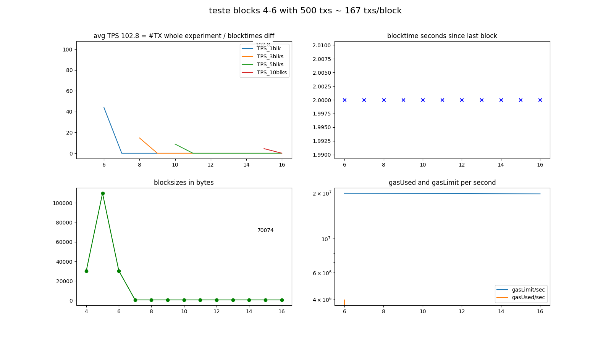

## (teste) Geth v1.8.14 with 500 txs: 102.8 TPS

### information:
```
NODE: Geth/v1.8.14-stable-316fc7ec/linux-amd64/go1.10.3 on http://localhost:8545
      consensus=clique chain_name=??? chain_id=326432352 network_id=500
SEND: 500 transactions in blocks 4-6 with 10 empty blocks following.
      A sample of transactions looked as if they: failed (at least partially).
TPS:  The stopclock watcher measured a final TPS of 66.2 since contract deploy,
      and in between saw values as high as 66.2 TPS.
DIAG: The whole experiment was prefixed 'teste'.
      The diagrams were saved into 'img/teste-20200729-1958_blks4-6.png'.
      Looking only at the experiment block-timestamps, the overall TPS was ~102.8.

```

### log:
```
versions: web3 4.8.2, py-solc: 3.2.0, solc 0.4.25+commit.59dbf8f1.Linux.gpp, testrpc 1.3.5, python 3.5.3 (default, Jul  9 2020, 13:00:10) [GCC 6.3.0 20170516]
web3 connection established, blockNumber = 0, node version string =  Geth/v1.8.14-stable-316fc7ec/linux-amd64/go1.10.3
first account of node is 0x8Cc5A1a0802DB41DB826C2FcB72423744338DcB0, balance is 904625697166532776746648320380374280103671755200316906558.262375061821325312 Ether
nodeName: Geth, nodeType: Geth, nodeVersion: v1.8.14-stable-316fc7ec, consensus: clique, network: 500, chainName: ???, chainId: 326432352

Block  0  - waiting for something to happen
(filedate 1596052515) last contract address: 0x06FFE7da847332d2B5E8A738db23aEF949b8Fbf2
(filedate 1596052687) new contract address: 0x06FFE7da847332d2B5E8A738db23aEF949b8Fbf2

blocknumber_start_here = 2
starting timer, at block 2 which has  1  transactions; at epochtime 1596052687.7076495
block 3 | new #TX   0 / 2000 ms =   0.0 TPS_current | total: #TX    1 /  1.6 s =   0.6 TPS_average (peak  is   0.6 TPS_average)
block 4 | new #TX  89 / 2000 ms =  44.5 TPS_current | total: #TX   90 /  4.0 s =  22.5 TPS_average (peak  is  22.5 TPS_average)
block 5 | new #TX 323 / 2000 ms = 161.5 TPS_current | total: #TX  413 /  5.7 s =  72.5 TPS_average (peak  is  72.5 TPS_average)
block 6 | new #TX  88 / 2000 ms =  44.0 TPS_current | total: #TX  501 /  7.6 s =  66.2 TPS_average (peak  is  66.2 TPS_average)
block 7 | new #TX   0 / 2000 ms =   0.0 TPS_current | total: #TX  501 /  9.4 s =  53.2 TPS_average (peak was  66.2 TPS_average)
block 8 | new #TX   0 / 2000 ms =   0.0 TPS_current | total: #TX  501 / 11.6 s =  43.4 TPS_average (peak was  66.2 TPS_average)
block 9 | new #TX   0 / 2000 ms =   0.0 TPS_current | total: #TX  501 / 13.4 s =  37.4 TPS_average (peak was  66.2 TPS_average)
block 10 | new #TX   0 / 2000 ms =   0.0 TPS_current | total: #TX  501 / 15.5 s =  32.3 TPS_average (peak was  66.2 TPS_average)
block 11 | new #TX   0 / 2000 ms =   0.0 TPS_current | total: #TX  501 / 17.4 s =  28.9 TPS_average (peak was  66.2 TPS_average)
block 12 | new #TX   0 / 2000 ms =   0.0 TPS_current | total: #TX  501 / 19.5 s =  25.7 TPS_average (peak was  66.2 TPS_average)
block 13 | new #TX   0 / 2000 ms =   0.0 TPS_current | total: #TX  501 / 21.3 s =  23.5 TPS_average (peak was  66.2 TPS_average)
block 14 | new #TX   0 / 2000 ms =   0.0 TPS_current | total: #TX  501 / 23.5 s =  21.3 TPS_average (peak was  66.2 TPS_average)
block 15 | new #TX   0 / 2000 ms =   0.0 TPS_current | total: #TX  501 / 25.6 s =  19.6 TPS_average (peak was  66.2 TPS_average)
block 16 | new #TX   0 / 2000 ms =   0.0 TPS_current | total: #TX  501 / 27.4 s =  18.3 TPS_average (peak was  66.2 TPS_average)
Received signal from send.py = updated INFOFILE.
Experiment ended! Current blocknumber = 16
Updated info file: last-experiment.json THE END.
```

### diagrams:


### info raw:
{'blocks_size': {'10': 607,
                 '11': 607,
                 '12': 607,
                 '13': 607,
                 '14': 607,
                 '15': 607,
                 '16': 607,
                 '3': 607,
                 '4': 30246,
                 '5': 109903,
                 '6': 30443,
                 '7': 607,
                 '8': 607,
                 '9': 607},
 'blocks_txs': {'10': {},
                '11': {},
                '12': {},
                '13': {},
                '14': {},
                '15': {},
                '16': {},
                '3': {},
                '4': {'0': '0x126cafe3e899d4e4b0dadbf474456bfc649232705d46464d23b58a071362c246',
                      '1': '0x5388f04f0f39aabd46eb651c3e6f7c5de6f2ef888a9d6b1d2e83256796975582',
                      '10': '0xfc4fc38ae4e9eac185c1f113c852d456d135df5a0a5ee9c2765430dabc80c268',
                      '11': '0x741fc316014cd451e2ad92a931daaa7e29091d423640a3e7e768eb5da393abc3',
                      '12': '0x3b9c9e53c4c7de66636f0430aae1e613f093068c081c7ba74f0f733a769997c6',
                      '13': '0xced176ce110da397b6212d5ad7af650825eb2c57b25dab722b1447c1ed5ff0fe',
                      '14': '0x5b63344e6575071bb096d61205e563caa07ff51e823c0e717452577b64d103a1',
                      '15': '0x8303367007e3e9b9ba1941afd843815f918080e5c3262263b2f439891477dc8e',
                      '16': '0x04a552f9700b1940f72d13a08876d9e0bc63c1b77c8128c3b6ab2767d74201ff',
                      '17': '0x8850cbab760007bbca30a624b60aa4e195a138ac9e2a8225e5e16a285ec319a0',
                      '18': '0x475ace2c6e32b2cdd055b3fd548ea00e2d9024d9823877f5a5bfb64cc3ed0ef7',
                      '19': '0x0fd595771290001c61d82ba49d30fe32eeb99c925c6762312aab043ad75f4a62',
                      '2': '0x9a5a8bad4733be8ec5c849b5612d27462106a8b8b15b7c3749557c889233a252',
                      '20': '0xffadc36125edd45af1e49272328b21e5f259b6a985ee49c50b9af0a99e98ae35',
                      '21': '0x20ae47a463a8c4def1dbb7109016e0e6eaf507daf58f4bca7cb5924d94d17237',
                      '22': '0x1561db39e0be4009896fcd7ec44d20239b0f5b28a761b209a3cca8b397fa0a3c',
                      '23': '0x4cb484b1ecfb50f58ac551c64fc6d9600d1dd34435b11c8b158cc64385fe8bc8',
                      '24': '0x68efeceb247a7e7e09614897b2567a8ca76ea80a0ba45b14fc94425164be9a2f',
                      '25': '0xc88794e8986c2b02a9c4a2351470d78925590ade6a1a454229e7deb92e82366a',
                      '26': '0x4b8bbfde038b1baa809eba93e565c99e67adff42687513040a277790bc131f93',
                      '27': '0x13e1fa8cbc45850207349779da3d8706820cf92bb8dacd4e0dca7672e7b92ad3',
                      '28': '0xb43477983e85ce4c6ab9786ed44b130cb1851b0e9ec42bb916648d28396ec14e',
                      '29': '0x763ba9b063befc3411d7b414fe828ccf7d68988cb79d9d65059e2690d3c9a811',
                      '3': '0x1e798eac25fcd1041f2512e6752b204b79a60bbb841c092fa783f40072c49dad',
                      '30': '0x7f1844822e6091cffd5b46636c5fd6c732677585def95980a421774054e1fb2f',
                      '31': '0x01fd0601b3942024224f68c774ba48ff0f40a9c4a777fe888efc89b0bcc34a36',
                      '32': '0x0415a024b7fd2af8facb77a71f3bb95ddc54e5de9fd0df7ed5b026ec42ec5908',
                      '33': '0x3be4a9520f5da6c6ed50fdc7328a038e6380ea1043609f2d89764d0f020af915',
                      '34': '0xf416ca0d43dad2769483e19e5be7a77f41dfad21980294aa6636d410d3948514',
                      '35': '0xc115722d06d37189beabeda82dd70afa9a7218fb9a065bdbb48a92a8861987c5',
                      '36': '0xa61ca4cec9e03872cfd39170513495af9cecf06baf6b492911647b00a6442382',
                      '37': '0xedaeb0224946e421267732ea4bdfcc6a971cbf1cca79138dea020f292b0b686a',
                      '38': '0xaf5ccb94fc97ad4f6868139e660c8a968f0f97da3df2f317f15bae47c8bf763b',
                      '39': '0x63032f8197500b375c5e22fa7a1b6a3f88ccd561ad01c2f3a093253ea23cc553',
                      '4': '0x88a57bf0545c748bf3201dd8968627e63696aaaa2aa5acf7eaded4c3b85cc0b7',
                      '40': '0x5ef464cf9e360b1fe6ac6e2ffda91bbe7484d2e72d26265ff54d938b7617702b',
                      '41': '0xae5c0c95f2143e8d24c04a0231fa65c68723a7896175e6663b631ddebc073a7e',
                      '42': '0x8f3cecb0ecdca63fe9fe532f34f363b6d10756521683a5be4ca180bdff7aa73d',
                      '43': '0xd87bd0f3b662e189b5c77e06bce45c5abe8130e0581c21103552e0053b84254e',
                      '44': '0x76c28ba97bdfc868f26f04cd3e0692ecb17dc499f4c244dbf70594ccb679b70a',
                      '45': '0x92a443840822f40070fd1ba2b601dc53360a9187c96d426f5fc684b116f01d28',
                      '46': '0xef58513d5cf6c26a02f8a3680a8cbb6ecb2b5d0ffecc570b6eee128746a4381e',
                      '47': '0x4d19ef3d3059fd5042806e820edf58c949024d674374fb570ee8bfb6fd52ee9d',
                      '48': '0x7c18318032b753a3ace881d3204b36cee25d3c8b0ae87be7db5bfb4249502b14',
                      '49': '0x8f33a72905d9a3c6ea4da2ab386ab3ba48fcfc962242cc6d29172f6a99fe53ff',
                      '5': '0xd0757a85da0b774e3d2518c46702d0d95e0114db789b01dd31c93f1669a0447c',
                      '50': '0x134211bf4904ffad28b21facd4145ae85d3a146744bf56af4a2f3c7ee501e235',
                      '51': '0x0de2234d9e95a1744b06374ad88ff73f0ac670f74fe82a235fd8d1e76e0ef4e7',
                      '52': '0xcaed0862ef40d8cc050e338836c93db8673bfd38f5fa3b1d208a2dbd686ca9a3',
                      '53': '0x440159c9e09060feb31d0a6328fb92f68026f9ff4346af768508064b0b6f8f0c',
                      '54': '0x821ae47de366f9472f6e6ee04a80acb3f1c23b26e68e7eeacd37ebe8d1cf88c6',
                      '55': '0xe876d51e68423ca8135ba4bfed3842f4530690b8d21ead82ce74f9d5d1f4be56',
                      '56': '0x5318f9e620e16e93b1c21c6905469e39176f5d45359c8fa75c77d1f82482ffbb',
                      '57': '0x0e5f67d63b75c90478d73ae5b023721df48250fff6323d59c2abd50460483ee2',
                      '58': '0x331288ac916e4d6b06fcd16903c0d3a23d5ccae676a25aa52b0b372e738811e2',
                      '59': '0x9b26e98b439bf38af558d8d5f0aa463f1cfb3de8a5fc5bfffb5344a2b0229089',
                      '6': '0x5e90a9a2258a5c85c3fda0ed1128192d349fbe2284cffa968eb32695d04d1e50',
                      '60': '0xb1407038c4dbce3b78b30f874d51455104a7495c70fbaffcaa7a01760416863e',
                      '61': '0xe4c58442df2265b4075786eb59ef1e7b6cb5db4db94b76985b93ae1d394715dd',
                      '62': '0xd6dcf285b430f83ffeeb4aa415e7b4f93b03fad55516211ee37dc42eabff555a',
                      '63': '0x517a94b92ccca099b41e97419a0e041c2809786b3a124c650f6b2b31fe9eb276',
                      '64': '0x0b5462f6bc57ef9ae297e82da082d493df513313f66c7e9e9a24c6bfdbefa514',
                      '65': '0xec6820f69b043ce10451605b5c8a0de3c6a046f5a175e25ee9038a55fd402377',
                      '66': '0xa86129c330e33770b04a0cb2465aba7e75db7b2d327084d5d6f4ac654e123d3a',
                      '67': '0xe563efe8cf4146e7664f5596abff8aa06a4b16e2ee9a6b45c6effbbed7bfda95',
                      '68': '0x2292b35f4ec34ebb8e2b0a0514c5cc782d1304a2b1c3b9515e89a37aae63bef6',
                      '69': '0x548880cb8df10be7de04c2e5aabd0034cd6f64424e126533d1fd7d7f93810b97',
                      '7': '0x5d56a172aac5db4832bcc7fdc452b127729a01775dded0ac24060ee5b31d72ad',
                      '70': '0x118f63c600a3feb8d49343a20f86efbc68b15da526ac0194bb0d3edbac9c13ca',
                      '71': '0x1eb59d3c33c79badb04322b5b146abb065328130ad1fdb3164e4cbdc7506dd9c',
                      '72': '0x8bcb6ef1137eb310271289cc820dc39f83adb43c81939b874e3a099e30499f60',
                      '73': '0x6b8a38add85d2c093d2f6857e6a62ac0196ff5c45ae3c485da0e115aad5149d6',
                      '74': '0x4490ceeb9b3bbed74d6f350e28fdc5914d2df14cd31e856b47a6ce8b802dd171',
                      '75': '0x78321b886ef4f0e4808b576c0a746f6b4baca190f40b6a8f02e3be3cee3cb82a',
                      '76': '0xff09233b80b62ec5e72e2572dad81be873911143def96e474dd4ec736cceeeea',
                      '77': '0xcecf988f2cb76a68cac659ce925117b74295745f715d846572c3db13441fbc2c',
                      '78': '0x99f4e5ee64c56e0eead62e02e125009799e3e1287ce5c736448f647220366167',
                      '79': '0xc241ba8996eb03ea304b38457801a14438b20ac68cc04874ec8e3ac5e5bd2cb3',
                      '8': '0x38755f42c7a8c324854f7217050e697f67d1aa66c7c56c64995eadbdcdfcec26',
                      '80': '0xfb395bb0f9ab44010013c2100bc4d6379e41a9c00c43c91c741d642409d534e6',
                      '81': '0xcdccb6aa12717f9581569c9550e24bb6344454e623de9fabac5573f437de581b',
                      '82': '0xd37d353923dc5f2676b8306b6f9dc76d5bea36ce608c63e799d118f55619ce40',
                      '83': '0x302441ca0e73379f9f863dbfc2b7c1cc36edaaa5f241ec06fc0dc1ca4bd8cad7',
                      '84': '0xf421939ce2ef5db45ee75e790c173dd78af9af392cf8cd433d465c3eac113ad3',
                      '85': '0x836707188e3763c96af0ad748ab72b351375e9473afce701478a69c3d4452832',
                      '86': '0x1fdb9ade48ba7a65d74109c98e9d3d2207e76ae02cbdbde8f12dd22a2d8bb70f',
                      '87': '0x002319b4296d79b7bf3e3ad274f656eb679f96f91020faf7049531114703482c',
                      '88': '0xd1dcb09ffc0e3a7fdb8f0746d3cbe3415d7e2b0ef3789c7812434cc3e77732fe',
                      '9': '0xbcf5b5355664389a45c6b7e4356be7bd84e88e4de753d03f71683db92629d2a7'},
                '5': {'0': '0x5446d13e08de28e886dbe129684377b3a19b9812d3794422f226069134fb81af',
                      '1': '0x7b6007d1aa418bca1e6ef8d20faa38c4ce590c5f9f0ab0aa2b0ddd4e57722a8b',
                      '10': '0x3e843559ecdfaea13c5189effce701cdb4f563f446ac9cd267001ae2b1bb26d6',
                      '100': '0xa1f34fe139211108f119920d8a50118670dbc23b5ac9fb7fa17557133d837182',
                      '101': '0x054ec925433bba5263e2a27b5661de631963b133704b485445cdc5bb03b3e34f',
                      '102': '0x26da774a7b92c3b01f23f1b1aecb55cadce827103bfcad22b98d93b0befee3a1',
                      '103': '0xba43cf1b0fce3e1a3694f29da4150ea2f359afb20a36ef0e931c85acdddba8b4',
                      '104': '0x7b083631ec0b24d4dee5462262e54bed162bbaa1f99ee5c237449bedbcfb0514',
                      '105': '0xe6be421a8965631cedfc391cf4dfbe668abf94bcf89434d23268872cb17882e2',
                      '106': '0xbc9c8b9f021683ef3e56888d2f8dfd778114f6acc5aac8609277130906b7911a',
                      '107': '0x9c49b0d8efdbe689ba2fcb7ae2dcd734f4e34008ab8e9366bcb3a5ecf706eb43',
                      '108': '0xf9a81cf009c0f2247a24710e1f42950a3930a7c06b1b82a4f45eceb92be33dc7',
                      '109': '0xc000fa94c5792c106743a770ec934046ad6057eaaedbc1ab857fc6bb4f5a19ae',
                      '11': '0xfb04da0bcf7319371cbe263efd24d110f8129dc188be059317aeb89d45a58d51',
                      '110': '0x9cefed9d4e98246c872e1dab2f226dd8cf22e8abbeeb4c43fa6fcc2182c8857a',
                      '111': '0xfa08392244ae13773d6de3e3ba6ae25e0a659f14ad3ca032b68329e5c15e6492',
                      '112': '0x2ec487db40090950b84d4c5d2822214a2fd206ea71879492b5547fb16a2941de',
                      '113': '0x802b8328b6c2586335b56e217797f52d1c5cca5a38c1cc392b55ab30a599516b',
                      '114': '0x3034bba502cc4473aae58fb04443d11de71a1cf93c3497e8ab63595ad56a5b6e',
                      '115': '0x625ff4b12641fa3f073f9169ebe8f72729a2873e51fbe1ed210015b3af171a1e',
                      '116': '0x6ec2baa86329b97543056b49e046316495fd15d0c9ed58f9f7b08622482f974e',
                      '117': '0x0d3eab9fcd5db5b187b5b5d72e4f7a2ca9efdfea7eef0b20803ff473dd401caf',
                      '118': '0x48e3fb01fcf2299021d182f80e710c7af28887b60a412f600958f59b7540553f',
                      '119': '0x3183fe7ebff94e76f62e2a35115586b88902e77ec38f8705c5946d83be677581',
                      '12': '0xbb49c803b77430c4ebaf69ad7e0639c22929e979162d5d76ed16e3047e9c1de1',
                      '120': '0x8c45cdf934e5489dcd73eaa3c8c9f2d7d59cb4447e1a391ca31ca3df7f6a293f',
                      '121': '0x49561680be0043112b0afd194871dbe8f98667852fb2a173ba51a8ec04629b3c',
                      '122': '0x476a89c956ca45443d6d9ff818fffca84efde518ca13ea69c67be009764bec70',
                      '123': '0xd7cc7ebc75a7a4b1cd51c4c18f4aedccf3b3c64a798e811df7091ffedad86485',
                      '124': '0xe05375b775ec38455d062b6f9fa8af637cf454ce569f0956beb82aca5d7eff75',
                      '125': '0x58c023e3b04154f40752c3f857e647aab8faaf5018b6335e0ddd99f670827a07',
                      '126': '0x346201a06c490ce472cb4e14037e99ce35ba9177c2e5b4f95c4706733b15b905',
                      '127': '0xfbf3c2565a1d35fa88cbd8c1b541b9fc04bd092d621cdb1229ebfd4ac7e1cbc3',
                      '128': '0xd732a6b0758c0578dc919aea8ce2b965b0ed9c6f8353fe6af379916ca1cef35a',
                      '129': '0xb20be812c08a8f2f6633b4fd72d1a99e08fb6cb80a209dd6338b3e13ba96024a',
                      '13': '0x9ec2b69efd24182e055f49236385604ec9dc769591db7b5ce15ba2dac0124f5b',
                      '130': '0x695440b08ec588b135cb5c090251b306053825b2e699735fb9efa3d16f1d2d14',
                      '131': '0xb936f988a1b75e447d8def33769f08f4dc55cd6ccfb5d87de2b39448d2a67c38',
                      '132': '0x0d5798650f0e9d69360372c68141d430baf6182c1899eac28f0cbc8fa9865797',
                      '133': '0x05bb1d132e86e62c081841c209694d7b4dcf24946f25d9f5a1f8ec8e6978286b',
                      '134': '0x70bf1c03f87787ccde4cd76aad84572f6279dcc39e538be70fc97efb4249e755',
                      '135': '0x2a431a8ad3fb1c257e28eb36c178ab587b5cf06be112da505cc6b663b864ca9e',
                      '136': '0x5ad62247f4bedde6dc473d74b40a36171535e2d5ba511e2d5ff93960849aa286',
                      '137': '0xd6cdd7452cbea6725a845ea9f6bb48a6ea9eb12af8687d786ff235c9747406da',
                      '138': '0x276d3c322b0e500070a115f95ed6773434bd2a580757ee40d61be953ee5a4027',
                      '139': '0xb7f282b261c108bf197a8b1cca93a216c0a4a81362641d72bbaad1647fca4efb',
                      '14': '0x4e7aba79df862d41eb2d29450b2aa64225294ae04f4b10bc38d279c08e133fda',
                      '140': '0xfa4785cebdd89392e718a35e8b7317c795cf16e4c17ac043b2ee8c65f203a674',
                      '141': '0xe0232f8ba5c7d12109b0c938290fb89407ceffffe4a972526fe75d75ddf9dab9',
                      '142': '0x9391c80afa2f35651fccde1d8533f524113c11a17c53c69f2d76dae2decbe20c',
                      '143': '0xf0c6188817ee544a9c0944236c107fa0b645b7c090a25866bf7e0fc718ffb3bb',
                      '144': '0xf32dd66f707ac6580c08a92078ae5679864cfe866acd7af599068d8c5fe0b020',
                      '145': '0xb294666b3b03bcffe332ee4ab3850e31ee71fbffdbf84359d6b27f4dacb7c300',
                      '146': '0xfe2076e39acd715009b50ceb43b15383080d386b86e80cc7478495c498fe9ef9',
                      '147': '0xc5a46efe1960bb62ad84289009325524fd404897ce70de64723a454af4a2ac22',
                      '148': '0x1847f638e9e62e7ebb8efd36ee37b0964af3f1a0832727b4335acf6eac18089a',
                      '149': '0x8e342b7b6883295c768c08fbedb5612226c0c7a9e07d7362ae1bcd75d195b5f3',
                      '15': '0x07a61363dee4d93652c53fd41af56042352c1429b5be79f4215c1490e2399f8e',
                      '150': '0xf9851103565899b771b255269fbd58923e4e0696dda92d8fcfff75d00ebc287a',
                      '151': '0x6ace1963387eda079ee9746f01996318bc4baa5b1c30b19c55bf230b2861e468',
                      '152': '0x585cb9c2ab63c524ff2ade4565a5f533f33f3a8a99b900d027752d06ce60df2b',
                      '153': '0x1f51bc9009d83e9ef8e7170b7019d1a3a0e821c68064df45cf7e8e388ec8e2e4',
                      '154': '0x86f30c168598953785ecb0ba17d619a8d2bca9f308db882c352d0d7458324f29',
                      '155': '0xb2b1810a7dd86e85b085dfedb35817398ad0a6d4f7af0313341c6376be4072dd',
                      '156': '0xa55d6290499cb9fc9ad0799af9b32e38be8ac71003cc933e207324fb1e5d83dc',
                      '157': '0x5beff5c7257f2643d8cb58d42867b5e8a77ba38d19604c01e41c0d35e83f987a',
                      '158': '0x5ab2dec229b13835ca200282558fabb029fbf96178542e0b90a62981a298acee',
                      '159': '0x080fea11bee7735065a21550237da86fbd32322f5f93f3b48e19c3b7b83a6693',
                      '16': '0xac0057a6171619e0d812c6ae9a0d9a454f9810c5302cf1f3422bf2f222545b32',
                      '160': '0xb3ffd1b404c05dc55e5b185268c238ac50bea26f38914c69a885b705507a7871',
                      '161': '0x37835d0fc83e670242e75c9ae0da58f164a3415484e6782cec96fe6c9e7c7bb7',
                      '162': '0x002d360a999653dfe95f77c21c9dbc33d328dca96dbbcfae6388f031eed93fa7',
                      '163': '0xf60f115b9d0ee57daeabad8fca580711524733e05b64c9a0068f9d91fc35a517',
                      '164': '0xa470995898cf69dbe3beecbb72dfc8d58ebf765097c8334b4ab13f8abd29f910',
                      '165': '0x9b53df8e2892e1da09e3817a341a84610e0e5ea966f3c2425fdab84b97e9bccd',
                      '166': '0x1a26706633010b1e05f1bb601e6ae5fc8a523459c594256746565061511223c0',
                      '167': '0x837517ca06745f69eb8f1c421069326f999f3bb04ddda3f2fb5a4b11ed6c7778',
                      '168': '0x3b96395311ebf12eee8768d03b34bf219b15681a73ccb440e6ad536f51822db2',
                      '169': '0x8cd926cc762f18a15aa5da8ca96ac24c1a904e91b012d9899674d8754db80e5d',
                      '17': '0xa5bd1e14c6846b5fb55add372374176bfb060d34c28315c6eb06761b35e4254f',
                      '170': '0x8e020c04f9f76ef12f94474768daf9a6f99115b8ca3bc3be8c3dcf01507a79e9',
                      '171': '0x12ecf691a38c2b7781922b394b61757861fc060da1834c1d502e4c02687b8612',
                      '172': '0xb3c0adeeb4c668bd556f8d1a6380ceea1ee886b2b1992e895691b183668e7d2d',
                      '173': '0x24f03b44042559bc0c9f5abd3dcefcb00b85de1b7da9c8c4ebef95aaa126dde8',
                      '174': '0xc6c68bb21bdf09654b290f1f6bcc4f33e6bdac3acc75be0c725cf11a8383d181',
                      '175': '0xe6b0cc774d711a6fb8d490cada51a1ff213e60b756ee76d05358336211863eed',
                      '176': '0x10bc2cd976c894c2f84971d7c2f639323213c12f5b6aac60b6138ca352dd1af0',
                      '177': '0x6a7ae75bb1c641711081334d523ab7b9e4cfb10f8a3a232b15e902817a40a033',
                      '178': '0xfb7c3ceb3ddc48793bbb9912bdbfad0665ee2afbd17d70f7b1a657d7aa249431',
                      '179': '0x7db40f5a89ee15062c410756b494fc00c16eb7f6ea1490f0e78dc4eabeaf70d9',
                      '18': '0x3ba466ad254dfd278ef574ce596020c6979b59891bc3d10acca6c80be50f7d12',
                      '180': '0xae7530b9d78519b1bbdf74049ea1384dbf209bd4fbb87c48c2585739696a9f7b',
                      '181': '0x1b5623f9e3ec63b889168b12652a4ace8afc759f2ea1344182da33286bc7281c',
                      '182': '0xf95d4523d16c6b37e860cb7358fc6cffead1eb6bbde733af599ce2449ecce039',
                      '183': '0xdfe55be52f8558946172ffd7b24ddd709e469539a54a3f64c4d3158dca0f4ba5',
                      '184': '0x6f1e6dbb0fa47045e286bfcf17db4408495b74422be17549a738f298e6360ee1',
                      '185': '0x6de867ebfc0a8377048c311435219234117deb884ef1b1c668275ecf58bbdd1d',
                      '186': '0x585e597617fa3c87d728df4debc1608dfd1a98e0f870f46ef5b9210d466473da',
                      '187': '0x86c225fe138b15ed89d5066ae8005912d92a8956813d072fcb79014c712d676d',
                      '188': '0xaf6819a63fc1259bb6676253b6f868b38ac861610e12aa0407c9a0f6e412293d',
                      '189': '0xc1ad64e6890c6a803978010012cacfb2af2e6c22e663985a11620814fc0ca1b9',
                      '19': '0xb36a3dcde224c86858da2e9330bda7cf0b0176f0eca52ff7563f32017d0bebb2',
                      '190': '0x4bd3b694d16076349158219a78e4c5498f10ab828dff33e1613c63e525a357c5',
                      '191': '0x92025b2c1f5f346e7108eb9a7c65f114a6a7ab537f7ea723b35d9752e2394852',
                      '192': '0xa7d091f9f3d3a87a01a468f02618b7af4b7a63a1fb71e6c06f5c29944f0ad419',
                      '193': '0xa23a2b6a201a5cac8f638ee1c51ebf383d1a0300a53c34f047e705682e702d65',
                      '194': '0x28a852da462731860cda22d12494e134ccd82466e9170fd4535cd2f0994a9097',
                      '195': '0x685bf3f7f6e6366b5d2c7b1c233759196cef75441dd068a905b8a3710a3b61d6',
                      '196': '0xdbbdb26861915527d7e83b17e31dae4200ed5165b2894dcf0ac0a3d13241a51b',
                      '197': '0x4af46e24ab89600d8cfbe4e82ea3ac87eda1384f041933bf0734bc25e796d652',
                      '198': '0x62e84b65d40b237dc06bb87370ba01f5328480694588bc0ab63ce73852822f1a',
                      '199': '0x3750a3037315485b38988b978da5ab21ed7c4807c8dcdc38d39dbd4b378af796',
                      '2': '0x9b4e95dee6aa98db17c33cf7cc92a3843a6058a3d82fd720f45650d6b936ebaf',
                      '20': '0x25c9763637d9a1732b439e12553a1bc190d5af8b1c230d7ea07531d436d5e491',
                      '200': '0x95c0db96389e0471d9bd48bde1699266590ed2d74346419e777ff7cd4d9f3a60',
                      '201': '0x2c4f30fc1b80948580588c5570a5ad90ca01104849a4a75942c5fa2897ef8bda',
                      '202': '0x6d851e79ed61c1f911f70b7246afba09d2fb23933cfb39f738afc852704b2244',
                      '203': '0xf9df48d6f15f01cea0faa6c8cb80038d0c74be9facbf81e4fc0e39af31612795',
                      '204': '0x60ada189f05140cc49eba1faf2795a609c2721dee568a3d6bc8ab48191651cf6',
                      '205': '0xa6bfa6d093f19da11ad97fe2f4164fd56fc17e541648aae99af17b4829c4d27f',
                      '206': '0xe6d9d9460f17144c389e1a2c8ee88402c64d0a7eb22507853f408d1934421170',
                      '207': '0x2462294274372d2db7243f451dfb341ff84f32a22258e5f0c15a7b398f7521df',
                      '208': '0x07ea17f8d14e3e0a98d5baf1fab825e0b4f95df0f7f8f7ca0b39188927abf4ea',
                      '209': '0x4720f0cc5386f916084f9b9ac1117cd5b80d8c7cc491f66c52f162d8bba1d581',
                      '21': '0x33e64a75eb07f5337906375d426bdc041fb8e57c39a3868c341c1dc6f72923ca',
                      '210': '0x0978d7ab72e26543265e232bc67a27781589982dbafa7ac9998d7c61f650cbe5',
                      '211': '0x99cb62bc62db8ca178e8930b19b63427fe54e1ade47fd2a046bb3a4a022e2730',
                      '212': '0xc6a9f053a165505a85d61689d4f8599916d3cb534488aadc103219ef976c26b6',
                      '213': '0xb63f4e8b37c0c429adeae84ee52b5be77a6f03f5a91ecb777da143807e1c6dd8',
                      '214': '0xc612e0847fdfaa9d02d2cdc28aad5e436b8beccccb468c66a70d4545851c7d8e',
                      '215': '0x9b6389d9126448e5265d51823c19b5d3bebdf293c030645acd95fe13ca869cba',
                      '216': '0x84093ff6989707237823793b2ca802b08be4e79069098918a2d628509d64cc77',
                      '217': '0x93aee092ee986132aa81da4eeb51e4a3d7ef34729f12d2b393618c2b4eacd59a',
                      '218': '0x95462f6723b81936e2fc07f23df17abbed911905ee6ab8e3086ef246588a2aad',
                      '219': '0xa37664e2afd356f3d091c891e05fc2c8c7d952d841685b254ca339bb93789e72',
                      '22': '0xbd6d8578375919d8f5ea58d8a57aa348b0746e01e2c2d6c426afcfa4f9daeee3',
                      '220': '0x6ad7378ddfaf7a67b9d236ff6d24416fa2db659ab5a4057915d0e343846488ce',
                      '221': '0xc887c6a2bbcf0e35e5280d6caf2941d2f273319da58f4dbd277680aad8d6dd40',
                      '222': '0x886600f1586b1295582224cbdfb30afae0816710d74735d7f2a5c51f34778376',
                      '223': '0xb3e1afccaddc5283e65ce120c7f09c96754515ee0b9986d89645b8362bbb8061',
                      '224': '0x97fb8888b0bb58d584447225e643cc6ac04e7df730635ec43c364b48e57a361f',
                      '225': '0x064db8486bca1bdd1eb101f15e77f64a1cf9cac1adf53d323e57fe62e77431fc',
                      '226': '0x09e098fbfaeef232334830b09d90c134953860d9d035a80bcfcdaf03debb1cbf',
                      '227': '0xc86f78c21acc7ca0990cf47c2ccb6a5bf41df5411fdd4f80b163a2b04f739324',
                      '228': '0x95e4c5d308cba79a11d0df2bfdb26866b5edec136d71dc07100cece16dddf25c',
                      '229': '0x847d208733e42761929371efae6f5ba18f09309e8b924df9310a59c9f6636e97',
                      '23': '0x237e33ffe7a84b1c0822af764014529b5ce2af2c42330aae2b5cf270762f98cc',
                      '230': '0x8d6c4db3af0f663db3c83ec54a75c7e7af4c02c1e37f48aedccb8bb97ddebf8e',
                      '231': '0xeb82f2543e1eba18954a9fb49db09937eb0505c47775fb6405a8310a3444db42',
                      '232': '0xdc1a1dfa960f5fff83a73bffe58dce01dafebf65e1831377da5b3284339cd78f',
                      '233': '0xe58e2c5523939f1730b2c83d8a6e78206c73f588889002c8faef97e3391b402d',
                      '234': '0x495fcab079f4a346b6f36dec2b1793c09250191d965eb386f96eb4939e0e4714',
                      '235': '0x7c93cee9416fb2323ea69d6520d326ea72c326509dbb539478ee39fc679b1d2a',
                      '236': '0xc780cbbf477b58f85d696a18f8a2969eb7a912424c9ed1d187c1988cb41c14ac',
                      '237': '0x77763fb68ea8c82c5a8efdf81f33b4152c71d15e936403d5bfc2760d03873af1',
                      '238': '0x6efcf8e1ee1359b22ffea331c354c8a377855c58200e76cbd9a02800b53003da',
                      '239': '0xc6823d38def87bc9126c9df486e6d684e46d8b0884d75544dd77031861bc43c8',
                      '24': '0x97e4557e71476612269c40052c54ada08cb687bd2cba3bb58918ea222d34d70a',
                      '240': '0xdd42fc32a74f3bd0259319190a43e23be054e9a5429b76219856f3c06d49a602',
                      '241': '0x9c18872e6214bf016cf393f4b560e84a1a0407846a876d042a9340fe04bdc262',
                      '242': '0xa081e791b5d6fb886c27d2840164b8647ff532aef781a7552539adecbfbdad86',
                      '243': '0x22557cd8c2a8de21caf5185e1daf928c5a4f1686bedf4aa345e9e11036008518',
                      '244': '0xc458c575d6be973740814b8ac4b5e0537813f673c5042d70da71075fcf329252',
                      '245': '0x9cb236146f124e3cf6552c5d0d18fb30a548f57a9ed89dc83a3f37f23e870bcf',
                      '246': '0xcf291fad3ccfd037d2c11303e2a11887384aeca096a6f7cce93926ce00ec5388',
                      '247': '0xd98348be26b0976b276c2c84d7f5e00a0a47ea752f58361bf7b1da0efa851107',
                      '248': '0x171e789c06f723df406aa72c41b38fea91850bd72933cb203a442c382a24c8d4',
                      '249': '0x1cbefa4521e800332fcb95a858b30d4dac1b742db7983c8a79dc06e70d5a32b8',
                      '25': '0x2d97fd2a653c8241e754656fa892df3fc8cc7ddb800bd8de60fda3476cfcbbb7',
                      '250': '0xeaffe9b55d111fa0db55d719ec87096b26a3127ceb9910b0afc6ce3f9ffce80a',
                      '251': '0xb22d227942248d66b9a6d799c55ed4a2f12760bad8619f08950110427a3ff692',
                      '252': '0x131de502b19eeefc7b180382be91f7dc7bd309bd2051b40f9ea791443c96989f',
                      '253': '0x78272c15dd25672b5b9b1170ffbd2117bbfbff9deb238d19e3b733abc2340a9d',
                      '254': '0x4fc8cc71986592d54ef1dd735cf5c3a25f69e070083ff0694b42d3e6ac676abf',
                      '255': '0x53f07eee4733bec6110c84bb2ac74cfbb9030608e0b918d7d312db82199a2336',
                      '256': '0xf60b4d5b94256c1c837494d8d3c74576908acefe4f650a3c60caf6861a17a0a8',
                      '257': '0x00f3c1f7198287d2f54203f169d55da06e2466a9df55afd3e01c9a64cb895cc9',
                      '258': '0x5e4914fdf8bf91190b3cd4ebbcc51de0f4e78eeb0f0ecd95105c649694be3416',
                      '259': '0x3c5b170b0cec6015c16c35efa15a88cced4de7f9ed3414f0e0d2f1e76f833dcf',
                      '26': '0x9e3e4b9cf583231d717aa0ae8b71ade77e0840ced177fb30ee5b6f9691798c63',
                      '260': '0x8320edda914e20422da1908877cdf3a985572f5a5492ab0ee1e09b8c5b655b42',
                      '261': '0x22437b4efbb853f7f5911a1f4480adf1608043e8bc5f62eb1c8ea5bb0bbc9ae5',
                      '262': '0xad1c1326cb7b1c4c849668068423a6afa066458b485f1e1e35c1b5ace8832253',
                      '263': '0xf1c2b6b57a3b2b3aecd6ddeb27625508e5f641a62e1e707703ac0e6e28ad52dd',
                      '264': '0xc68d3265ee803901b437df5e5ceed6c8b16f7b974e988fec1372537f95620c70',
                      '265': '0x4883a672ae4aa7f5ef02c9d7f82daedd9ea8b3f3a5ef4d9b6922c5375d41bb35',
                      '266': '0x333001810a4d86c1c45d0c412081bdb0621f3182e17f081e033db9d5e6eff89c',
                      '267': '0x0bcb366d08bec96e0799877a69151f90603fabcef3e1f9325c17c1ddf19d0038',
                      '268': '0x2904ba95f3b040d7ac161004983546dc12c67cc28d229a122f5991a06155fa8a',
                      '269': '0x92b264ac433123c63e02282e7b81a6da39d72b4ae1891690f89bbb87ab8845c6',
                      '27': '0xa0f34aacaf233b3085a7dcf874fbd4bbdc241e0caca8cf93204136bf0647eca7',
                      '270': '0xe4614e70442ac1477076cd24c2223646944e508e39e8bf45c86c6e179fba8cea',
                      '271': '0x3aacab70a3b17eb1c3d2ccfec2c0542f2c0bec85de833fa1c30a437354007451',
                      '272': '0x00aefabe599f928cb668d8f92f41a409b601cd836a6737ce8d6a124561784f48',
                      '273': '0xe28b2d972737c1037fa358adfdc1d7ed9200025fcdb7d271de5d8dc076cb0383',
                      '274': '0x6b9a313a6d5b0e686dd71ff8bec64dda8eeeae7e0fc126889f89e03e596957a2',
                      '275': '0x571b91fcaedfdd4dfbe91e73f3b6140d26421f8057de92430b80e9d46a0489c4',
                      '276': '0x534861aefcddf66fd3e772c142680c2af69d2edf1f4ca4a3dcfe2f05896a1db4',
                      '277': '0x3eefc041d5933e917d0b06e48b28faee9dd12f62d71380ce18dca9f01e7f245d',
                      '278': '0xeef647100bb21a2761e32553e2caddcd77caec19a70945887639513288a61f09',
                      '279': '0x577b74dcc46275d3ee2f3731f7db71f3b78eca2adbacb2417e0ee36c011e8bf9',
                      '28': '0x4d13ea934f2494ef015dc4a0e01d867212bb7808922f56b2be848b5c60b24ef6',
                      '280': '0xdcf6dc7390588d4c2263154a85bb9f241f39cf0cfa4ed8141bc173fed7c42819',
                      '281': '0xb51c0fab3f37d433091732124798fdf82f713f8a9b22659f57e7878820e152ae',
                      '282': '0x6c1365eb0f50af7bb6561e7ba389610b7f26195f679c8f17fa29ed890aaf576a',
                      '283': '0xc9e80f28cdbbca4bd5c44097cae943d77a89f5bfc80d873cadcbb429abdd82a3',
                      '284': '0xf8f745a61a939e69f02a210683fc341fc50c5057421ff0a037a7ffb8722f1368',
                      '285': '0x539af2f10c110dfa5c47716cc8176ecda3f0ecb7a127078a4747c7ea6d5f34e9',
                      '286': '0x4db1ab26ec9ced3feea1a57821769132c2bf3e437b7e30801e856e82f415605f',
                      '287': '0x410375d31c375c6d22c81b9660f214ca3fa5d2fc6ebc18b2b72e5c62aaf8beb1',
                      '288': '0x4f53d05d303dbb70a381b7d46622167dcae4d71472d023ed07f66f40c0c9c7fc',
                      '289': '0x593f1fbe6fe9dc2c4d1b463b120297167016196ba4e98c20d69e95d1f99dac0c',
                      '29': '0x65e52006fafc115f1ef4c0ee7550326bf4296a8fa0532b7295f1c7eaec6777f6',
                      '290': '0x4472e313f6bff68d55ffe5e0c73dbceafa4c497436910e95aa0674b4747916b5',
                      '291': '0x73141d869467c8a148e100f6686e0b8ff7f8e58e69714ee7b8222749a6d79b81',
                      '292': '0x527ac1e349b52942cbcdf0664d0211d2eabe39bb12db86ce538974e675f97e0f',
                      '293': '0x2bbdf674795477c709712524d5a1f618174a877fa465d601da6ad034f9628eab',
                      '294': '0x44dea9ba37f51cf0da649a350a2ccd019694dd328a31d9ac4cda03b3b975230f',
                      '295': '0xddbcc9adcca849ef0bb53937cb4f2b553389118a72586dbe7251a6942b3fe447',
                      '296': '0x605464ca902d1c0028ed027d74792bc8824c592331ad60c6e7e2da7349950660',
                      '297': '0xaae631976a3caf229077124296274871baa4df4376637763b6915b73007304c6',
                      '298': '0x7cbdcb76c5bec02ae449eecea9c003016c62f14cfd5634707980e1606c20f543',
                      '299': '0x75f94d42d9e2dee069f79dab41b23cb545af391b360796b4450be702c0af560e',
                      '3': '0x203b81e45f19f9ec9ceaf7e8253b6fb15254ce554c835b0e552a2e784b923326',
                      '30': '0xd2e7617039164b960f356849449f16090cd62751c1ab9c12aa6a0e399079e2c6',
                      '300': '0x910c3c64f50798e4795943ce515ab6358290f307d056da7c82708fbe535c04cb',
                      '301': '0x314ed836a5cc75095f138115315a9c9dc4c0c31e964329e97c52a1ca9bf2f704',
                      '302': '0x202f095d3228d0cdf27a523a8ba3c588b35a15f362a71f660e4d26eb3c233af7',
                      '303': '0x3953592c4cdb3fd67fd746a0b28e08a733a6f2f1d198d82230523e28feb35bc9',
                      '304': '0x7c079942bd0ed3caacd8fc86deddfb6b58a61a9d2be7d215f7826a938c532b82',
                      '305': '0x0b193e0b4d26683830af49ca6e7ddc658a6a580b402b426fb5efebc19491f13f',
                      '306': '0x7a9160c43fdc493fd62c11dbe878f6e3e496970c7fcbadab2735bed752761dfc',
                      '307': '0x68d6d210a19bee3f4cc032c713b85751cc1948ece0db635e88a5eeff9a8c072a',
                      '308': '0x2e5d96dfc4697a4baef52be752b5f5c3e9bee2b83df9be5b361528d73074358e',
                      '309': '0x8a79b954bec4f44968758ac86babb02824c27236e9107c7c257bb31373ab9fe8',
                      '31': '0x6ba090026989f2c7a169001992e1dad611061495243cafeedefb4ba34a2dd952',
                      '310': '0x145713467a43daae3f9f4863ac6b18c4bc691e06bca5c9b45a569c440178d449',
                      '311': '0x9422911167bd618e82f88ce1cec58d362a68784a8755de1e13c4ffe419281714',
                      '312': '0xb01af3c745df0b0f97b7452a287d827b86e4a1429a4b132bf87ba49617d7a864',
                      '313': '0x45a7ac9e28b964eb1b19c6a87b62d6154c1e0265c5aa4c01579625c8d500fb3d',
                      '314': '0xf8b8b1bfb20dce5fe597f7cf9b0f200bbc2f8fc21730d337120be21da6b9dc9f',
                      '315': '0x6929d3b91ab5912cb8318e704dc5c14686299a26d7fc9a832429134bb49d5027',
                      '316': '0x3d7e6afa2d3c2e8d02b1bfc0a977543f46ca4411eaec595436977b5c6f987e55',
                      '317': '0xf501383345499ee74363551152bf26977eb11d8b2fed259b1ae1ac63c32823a0',
                      '318': '0xe6fe8eedafeff11760e345a2f40d025a1cd1bd7a2e359ba8c972fe44fe76d0af',
                      '319': '0xeb157644106c83e415c07b1072b9b877ccf9427c8ff75ec74dbb5cf41ca1a27f',
                      '32': '0xd40605b277c4753fda436711802e2267d34e22c5bd3a142036cd6fca3af42713',
                      '320': '0x90c8672f7427aee7f1074e0d17186a190dfedf2ac1d3626b2bcdbca2e28b7fe7',
                      '321': '0x4d2e73ca6a3ca0368ed03f3c46fd136a3e087ee64836192d98278ec6fad6d867',
                      '322': '0x1d4f4d4b27167947e15f8014ec86ce69cdbed36c56777d8fecb7b3ca39688835',
                      '33': '0xae84a118c4e65fd195386e04faa2df3f3545d25e817e9b61b5a3090c63d067a0',
                      '34': '0x2809c368c3b3b94d48aa8ebe8c730f5988d56cf53cd4e500f823b03cad15a79a',
                      '35': '0xc36576e290e2bc017871f33dcd2ac2da02866c914167e202233f42380d57cf1b',
                      '36': '0xf46bcf899e3e94dc1cb6b17770240a56b7738f687acfa5e9e5123be68b549262',
                      '37': '0x6a8271bf9de0a728abb9ba5b509f4597493652552c82f656660bf87fc5c1fbc8',
                      '38': '0x167eaddc1f3f210054ef66f1bba036d389e6c0722f64d5babc903cdf3b1c4caf',
                      '39': '0x0dc00c1a135f22482a4bf655f361254b26b5f0a0c00530e44271cf6d1d9f9c19',
                      '4': '0x6d137902a49794cc4ae9c7580e274579837e3f4e86906c36e77ffd7168c359a6',
                      '40': '0xc4297509fcd70d6d2e4eedee6b147eba536e5f9597ac64676d0d2258cc04fee7',
                      '41': '0xee5fc8b9e0a3ea8cf765260c3f2b849ec6d9f001cc0ea21ea5a0333055485566',
                      '42': '0x58e68b89a9f029d2a467b8dbd3a1409a11ab64e1278ae574ff3e117d114d0274',
                      '43': '0x4cafbd5b805e5ece3d29927df7fafc35c4d93cefa3dd9e3c054a3ff31249673b',
                      '44': '0xd6c78cd1d6cceb2f87d49cadc701ea141aee4b768faa5817f2484bc3e28e1069',
                      '45': '0x6a63a7260113914f68cb88493852b89067f55087d2926189459d43c5f3acc45b',
                      '46': '0xf34cd6359a6401b02962c2304c7b45d58978dc470572b98b12c57507ef43fe81',
                      '47': '0xe1e1823b145122c58bfc5bce2324b9eabe20248096269e3af24f8e843465a340',
                      '48': '0xd6e1862ccb161216e1f78e111450de9ae66bc2704a9f198f8e21142ea6fb18af',
                      '49': '0x3756b3cb8ecb6f52a3c2d685f60a1d2823e3dac4292d424d0f8dffb74589a4c0',
                      '5': '0x0d09f944ad215cbcf0c13f81894155ca6374c90360b8507a3871d9e94b607c6b',
                      '50': '0x79de25aed66074aae29be9f9cfece9b40e6e66262bc6a6eead37a7d6791d0636',
                      '51': '0xdd735b59764fee4d322d5ec558923a43cab9fa2a8fb03b9065016d87b03f6ed1',
                      '52': '0x3eba0c694d037e52910657cc6890a6167299beff351621bb6740aaae65639de1',
                      '53': '0xa4cfcd5b4896e287c3d3fb1721dcc7dbcff9dab56fe174e5c3455bba3930f4f9',
                      '54': '0x9dd0175db442f7c46cad674eb6d9455fcb228d812086e60af77e73741a8b05f9',
                      '55': '0xd36713f2bda99b9b296191c70fd56e74ff734bee8e8513d0591d4cdbba78b410',
                      '56': '0x34c0241751003b229b3f16cbfa7abd86ebec39a2ee31b5a6285dae7b6ede2459',
                      '57': '0xe1368c363a250be5fbc5a7421a21c8585cd2b46955900c12272bc02d4b228cef',
                      '58': '0x6cd0db93c6fe77c91adeb3d4631ba7c179813a7a47f8588c4e5fa1775d2df45d',
                      '59': '0xb02231ba2070699149a65169bb3894b9af54af28d6bf513fb0874281a4d2bc19',
                      '6': '0xd971b4ff2341e8770b161ac7c4491562b11149dbdcd6ced7ed1a7aac509921ec',
                      '60': '0x24871bb381d92ea2d282778b419eaa17f77db520cb602dbeb8fbd0b2c8a89c9e',
                      '61': '0xa2392d8f6e1e30e17c04b688fe125a6b0c3d52f58ad91b26506f58a778ec8b74',
                      '62': '0xbbaabd39776dd6725952d2f3c44fc48cbe94fb8338558cacd0d8b2ed4dabbfe5',
                      '63': '0x546fee5cf6c3c53f6391e652b1fa72886d1759d3af44d61f6fc58df9d60123ed',
                      '64': '0x6219268b6d1fdf8e4319858f862fbb789cfaf289179935caa14a4914bb97a261',
                      '65': '0x91315c6dcbc9fd58efb52fbb9d3eb312eef4625f81329e0b343caef138c6d33f',
                      '66': '0x4a64602d6533cd08009d748dac668a431ab7228696af794f2c8c56deed72df08',
                      '67': '0x6add2bd663dbd02ac3415d0213a1ae4b922b4e9eedd7eb652adf2d7925a94ffe',
                      '68': '0x53dab81769b7e009d9c4a3c4686c6cb68691ebd245853bac4e36c01967ee1021',
                      '69': '0x6ab51e36e459782c1d3c41fe7611c805faa1fedcef4553ce6050663ad7a6ef7f',
                      '7': '0x9da0a79a0ffcf3449f1fbb9a2080d7f45417b2aec08c57549b52c0e69d15889a',
                      '70': '0xf2530634ffb3f907584ac1b64fef6d59cf8ea58b675d32701730639d8c88bdbe',
                      '71': '0x98112fb6847003e7efec0db801db0288b716744890ffd5cbb3c234d196cda8c4',
                      '72': '0xb096145b8b88bde60a0d76fd3331b7038a660bcd0d9bfdd2549edfc2e55ee86b',
                      '73': '0x28c8eb5380627f0c485e2b0a2ca257471bd6977641e642918e282269ecbe6e0f',
                      '74': '0x69b10958ed7bacd360a620db795da3b311c97ba0dfca2fd1d35de3b47fe2ddfd',
                      '75': '0x148050ef57e7196133ce431027fe8ddbb82f065253dcb7243f1899e02cdf6c31',
                      '76': '0x6967d629bda43473d21af5cf66ff86ae91199c707aa24e053bed91b5e5677a0f',
                      '77': '0xbb1a7b881c6b8069395385a53e5b9fd95ac5672f43a398f4542c5db237308d20',
                      '78': '0x4eb2fc4da4d1e91e2ed01f40fac68e7abcffcd3fa422bd35a6e2a8a6e77722a6',
                      '79': '0x57de90af0b495eb6d6586daf5b9457a26a10c6cc107c71e83ab46b47fd964a7a',
                      '8': '0x0c1fc1bc68eef73e5a22fd5ba9cb3666fba761a1eba4846de43a466a32fd4e66',
                      '80': '0x7543e3aeb05844b168887e9ae3501c8c2588dba4f394cd9a5295ab9fffe110db',
                      '81': '0x83cfc724cdbd4814a07390117e0f275563e16add31070b04230ce37b88039a31',
                      '82': '0xdb15e76d14fad3070091000f0d95ea78771ae9e58f4cf52daa0e8f8b6820fcb3',
                      '83': '0x9ae45aaf50b3dad96b1cab072e745f6c0701533ed3ebdca6209ea4a26eea2f89',
                      '84': '0x4e1f7ea38dae767e04ea161aef3f143b2c864f1b83f01c1c1a5f57cd10a21b73',
                      '85': '0x7bef48c9239d3ef0eba07fbd65a486941f3b81cd0146875ceaceae3a22157650',
                      '86': '0x4b89adc7d859a1bd1d04aa56b2991073259c949b777d3516e87f9cf258bb2a37',
                      '87': '0x7926548a62312ebf1edd9b9ba5dd50d62c97f599d3e210fdd61a13a81f78ffe1',
                      '88': '0x207c551c6e606d5a47749ae62124e2331b45c6d2eeb76e4f4df70e6a81b736bf',
                      '89': '0x02261e57d9af5c421061c68398772c01ae51721aca0441cb799662b3c7ea788f',
                      '9': '0x02e5248553ce2b1ff2abc8dae836c0f883b322e0656c395519b87ee356e7da15',
                      '90': '0xe4a69c7ac1a39a86d01d83af9fa8a30ed26eb59a239bf92762fdfe76e2dd27fe',
                      '91': '0x2e2c90332f9dbd9fbb244aa4befde40f64aa82de9b64f24aa9eec751d191ab22',
                      '92': '0x4173e90183e1c45802c95d786b9c6956b55c6bedd9189624376274cddd54b042',
                      '93': '0xc9f0799d434e079f84f59c3f5066b6d1039a1b1843f1da9d99e3bd0f904de6f5',
                      '94': '0x98476d5c1cd813de846ee88d998afd668f5648c8d0f54e3d24732bdf1f14c7aa',
                      '95': '0xc596ce94b7975f61bfc611120775d102b0f401ab592ec64bb50dd88c826874f9',
                      '96': '0xfd17aec07a49e22c6822dc8ecb5aa3c24e0b16cdaf5558e1a005e08580fd600d',
                      '97': '0xe88a18c37076c0f33a39242c838e9b653da0f455b89e51c876e802a55b000ebc',
                      '98': '0xc8b8bcb3c7e7f67ccb6e8aa41db1662ffeabf79d8b436453ac5e0e77d0533a28',
                      '99': '0x8581f8a5730c1c00c1c1d30f740721a9ed227872a5e8ffda08a7eb8134238e69'},
                '6': {'0': '0xdd2b44415bcf194169a93b180a24d31439319264e5fda563b3ada570f844fc6c',
                      '1': '0x33e776bd8a40625ff47c824b2a4284935da1a659325d24ed517563b5f583dae7',
                      '10': '0xd2c6f699a03e775be2c9c36912af0e352a4c95825e2febbf77caf0fbb076e0f3',
                      '11': '0xb875e98f378df959fb053635d1e913a6e320526b3e76fb3f4037b63708b50fac',
                      '12': '0x0995bb132c13066cad605c1598013fe00d9fcecf6f8b92e591b6e8b301ddfa2f',
                      '13': '0xa68f603caedbd72d71d99bbeb1d4343ee4b93bea80d5d8aa457897a497c64d9f',
                      '14': '0xc13e6813321c39d8701aebd2b2a1d55bd15b817d2d7575e9b5902b5bc88b3cef',
                      '15': '0xcbaafa2bdcf8288db5362e246e2813c3e76cbdc969a34ce577b102383cfdd20c',
                      '16': '0xfb58852b0f75ab51c0c3d89226ae08cd4d335bc316f30d2b42af708501639725',
                      '17': '0x5724cc55728c3537b25d4593027e68029a7cf96c347b7f37fa67b11b9c371ea8',
                      '18': '0xb00c7329298334a25dbe4e44c9c627bbc5efb4d1a6d796ad075cce3c22de4806',
                      '19': '0xecfe24299232bfd3c620b5d9e26cf67519453cb49269b1b81112adcc9b6c119a',
                      '2': '0x0f1f68a23c7995586838feae582a7c3e732439ca20154f2f0a0d9f7174ed6a6b',
                      '20': '0xa0b655fa7b740e25d236f03a85e437b66dcfc26f72c6ce71862926c6391827c3',
                      '21': '0x914a457e8d477fea134707bf25ad10b6c92522b9421932be0a67158ed70f89aa',
                      '22': '0xe5862da898fd13b55f56f29efff62f02aab3a2d5cd54c1f49c0c81dc5cf67dfe',
                      '23': '0x04d467e1057e3628f3c390b7a8a0c07e76263e94bad2d366fa976a8485d69fbe',
                      '24': '0xd53692719ae0e63466544e1da1c2a3bc9fe7fd3c933c398c8ee3e1f0abf153d8',
                      '25': '0x6c9b1b9d1062d63f0ce6f6948fd00156b5ea844b54d8146eb29e4e9fa50b13fb',
                      '26': '0xc343cdee69cdbe46812d7ea2f0271ce0002679dc99bbfcd81d6291845638f0d5',
                      '27': '0x420caa6c32e3014274ee5e3cb5b926b2fe668aaf4ba15b103e4f48ce1a9364bb',
                      '28': '0xca87a592e5ae0439c4a378e94adee3fd9e70e879eb9dc3e8b16f9b25e99da047',
                      '29': '0x41f256d5da58cf55b31950840e8f70d32ad5b820e587f512bcfd387a37b83594',
                      '3': '0xe418df60d1d8704bdf5ef5e204ec23b9abdea052b340acf7f72eb5e29a404617',
                      '30': '0x255ae12018281e5cd8cb7410f47f411329755abd5c37fb0fa03a5409d872116a',
                      '31': '0x77b64d4bef51d8a61e8f24d8bdb6981076fa8f88c059fdb2b7af265615a25671',
                      '32': '0xfd8e1c63981794a41d58b0f7c196c8808e18c5c90cbcdcdf6c9730138791b775',
                      '33': '0x70fe76eb77585d2209a71a542f81cf73d926f3f3156bf5f75edd63c57816dad0',
                      '34': '0xf7680546e2bab16b154fc41c86cb0e58d8f3d2a3ab10839d1602f888c5a5ed9b',
                      '35': '0x2a5dce5ae749a70cc233fa30621c6459fc51875c1fc981ab2b7ed7f3449cfd0b',
                      '36': '0x130cc7adb48dd5905da543ee33936e53e888c5e49f61cb340a74dcd90a789e52',
                      '37': '0x7050caecc7f52ab573a1abe240ca3afd7a42336129102a1b8d0ff6bdc2a7f12f',
                      '38': '0x7cdcf960e1ee351f0c72f879ac3106c61721fdf0d5f370f8b22d1c9da384d0c6',
                      '39': '0xe2d0562d49c2abc364976e74a4010bafff9d96abd3c1e2a610174777baaeb600',
                      '4': '0x8c5c0df23d7ca2e3b8846900d06bbf3344e973c7beda07a24a42275e0b8c37e2',
                      '40': '0x79fe47c14958954953f12ab0ce018b76c9dcb95dde05190fb3e107eca3b3d035',
                      '41': '0xd5db8c836ecd1480ed1033cbedc1ca835c62a4d957fffab469cfd900f51d87c9',
                      '42': '0x3acf876d876164ba4af995bad51b19569f0410bcf37452e0c67e5e0ada416e57',
                      '43': '0x79c94ee515477485916e220958db7c81c45e79cca0190b28791b6e97783a90df',
                      '44': '0x0568601100651743ba707ef7d7c655ff4e1ebe9b324fcd52eff4d8cf70de15d9',
                      '45': '0xfeb26f02ab57924f68866501623d9eaaca2fa47af4a0f8f848f1c855091c658c',
                      '46': '0x7eec7e02afcbe0c1bc3216c8686016f231e154dd05e5d147cc3d30c81909e6ab',
                      '47': '0xb17562a23f98a2eb75e31a7a96a7a635c9ea4568290dbb93467fa22a9bb77224',
                      '48': '0x8a2f1bf7ae39ba1d5fdf5eb715ef867ec9d8d7647d35513e9dc0308c61183641',
                      '49': '0x12632a6037de7024ed060faface0bd10d1645d0e62618b101e5d59978f3bbd03',
                      '5': '0x44c00319552ab2db6c22f86e6515144a9d932ad10baa9e8321b07b12434c6d93',
                      '50': '0x3f032da3fa5a07161986c8a71c65c080368f095c8efb94e32f5d4ba47c786a27',
                      '51': '0x351bab757463aca2db8fec0b7f247a1cf33bb7a406d124320222afdc1fc8455a',
                      '52': '0xce8be1cdf90e78fbbafec2494af0a957b938db806ad7600f445cc1d4ccc70428',
                      '53': '0x6071994699805066465a7f254b1bbaab0e443e995c06b150b1e93a75f53aae95',
                      '54': '0xe73917158088f1c514f70a7ae3b43e9d437072995013c7c1811fd8c8e6b5ca30',
                      '55': '0x05054837bb69d98f5f23827bb16da91f681ef6545746633a664430ce29e74fcd',
                      '56': '0x99e98a4216b4c43b8869652e962a68394130a8cc5e7fe4ab857170e159681f8a',
                      '57': '0x730828bb1c72c301c665e9c2ccaf4f4d7f150731630e64e4d16af607f84561eb',
                      '58': '0x5663d8da07ddb89c805218bf347704e2bd250b73554f18e005ad11e0412379ae',
                      '59': '0x2f5e3d300a9ba2a9265187eff3c2638966d524852519155d42d515d552bcbbca',
                      '6': '0xaf731fd0a7c29f713824c0a761dab7221ec28dea08a6ac9a6f6590da3ccb0675',
                      '60': '0x666849603b99b9ea2f88d046c0444087f7698939e052facb4ea7e44f3f67ca4b',
                      '61': '0xe4404c5b22494f4e9a159d12eb1d3caa0f6adac3e6b6e308c373f2bcad7eb3b6',
                      '62': '0x2e0ccdd13bc754140ed5a14258617317593373488b67fa6beaa1ac05bdf069c3',
                      '63': '0xf1c197aca7d01140363c4b391bf35bea43569979ff287df48ffe808eb377fe95',
                      '64': '0xbe7c16aab554eec7f1913adf17c755f8a7595dee119ee616eeb8f06665ff848c',
                      '65': '0x4c8439ef3a9a9b8cf73a05204eb130a304e4372315d17807a8539721c992ad8f',
                      '66': '0x65c55cc05c56b24deeac7cb7e5d4ff3b6aa970c030e4a46d73bcb4a41cdd28d5',
                      '67': '0x536a3c99c1489a9c847f26850300d000239b4127d738d97693bfef7cfffe3372',
                      '68': '0x040e8d04cc982db775bd8e580d8337510592ba786e1bcc477987f77009241473',
                      '69': '0x263ade1797c45e59a177dad65d22f42216e861bbffaa4eacdc601179a0cda3a0',
                      '7': '0x711d19a2ffba19c7bfd4cec9116531ce9b2f7e988985eeef4a3d333122a018e7',
                      '70': '0xc69476fcc544bfcc96c7c155eede615a6d8106d0b5acfe49b176cd674e73a6bf',
                      '71': '0x63a1df135f937110fbca69fe640e765388d09b19cbbeba8a4a8a7c1822035c8a',
                      '72': '0x9574a9100d58d66d6205691ed7bb23ed074a0f824a9003e0250fc90b87ac5398',
                      '73': '0x99f2c22faab3454ac9dfa845b1dcf9db53521706ee9d0b84472bfa66a2dd3329',
                      '74': '0x5224cefaf88312f9a6c827b0ab4d901a974af81697b99037ca00fdf945643457',
                      '75': '0x735512d69491154ac0fe59de64b54e38216c1adfaad471d50153d70df3ac5620',
                      '76': '0xe249531542fb3e5c4401bab2e61e3de7eca84ebeb8c1f76e0ccdf30b08fbfeb0',
                      '77': '0x5b7925cc68f82ee1c504a3e3f33991344c41411a09ed69d75c54039ba52b14f4',
                      '78': '0xb13117f06f057958d7dde43e72d72075a701a9eb1ee172cb32eb56c49c017b77',
                      '79': '0xb93256e62bf93d161fa7bde58051a32395ddfe81c6fa3df3312c00b8449f3833',
                      '8': '0xbbff072a9136381d3fce1c33d64af61c813ce6cb2f5caecf00f166ee68f7f891',
                      '80': '0x5d4f8a5c0b702fb411cd629a5fbb4480d92e7fe5c89669b8d65c24d2e8ce90c0',
                      '81': '0xdd21238945621767d4133cdedaabe8527fd5d451a56d01e8c309bcb221349308',
                      '82': '0xa682d18e7a6e6ba890c4d30670f7fd3ca00ba8b6948f6361e425985379681486',
                      '83': '0x09afa7b49a1470eb75ced0efe40d887b14e968b45fbe775929d86e3ca593315e',
                      '84': '0xbffef5345ad8297fd694ca7f528f6ca7b1ee13efd9030ba2b8cc3ed47dd1c6a3',
                      '85': '0x0289b53f6b749f5f8c3ce42ef7e0ecef870ae88097ce51f5ead8e3f8fca54a0b',
                      '86': '0x7b259bf521449b57ca6e15090c0db2e4376b9b6fa864d30abf72bc2b3a0e334a',
                      '87': '0x88f00b5e6819e5d9b2fa15da0909b35daa067c9705a7cf96e70e43c8cdb6e2ee',
                      '9': '0xe7e5f66e4f9df11e1fedc3f7bc4c5cfb89aef7c6043ca4ee6c36cd73cc2ea13f'},
                '7': {},
                '8': {},
                '9': {}},
 'cpu_usage': 28.8,
 'diagrams': {'blocktimestampsTpsAv': 102.75,
              'filename': 'img/teste-20200729-1958_blks4-6.png',
              'prefix': 'teste'},
 'finalUsed': 5659164672,
 'initialUsed': 5656821760,
 'lat': {'10': 15.29235053062439,
         '11': 17.29235053062439,
         '12': 19.29235053062439,
         '13': 21.29235053062439,
         '14': 23.29235053062439,
         '15': 25.29235053062439,
         '16': 27.29235053062439,
         '3': 1.2923505306243896,
         '4': 3.2923505306243896,
         '5': 5.29235053062439,
         '6': 7.29235053062439,
         '7': 9.29235053062439,
         '8': 11.29235053062439,
         '9': 13.29235053062439},
 'node': {'chain_id': 326432352,
          'chain_name': '???',
          'consensus': 'clique',
          'name': 'Geth',
          'network_id': 500,
          'rpc_address': 'http://localhost:8545',
          'type': 'Geth',
          'version': 'v1.8.14-stable-316fc7ec',
          'web3.version.node': 'Geth/v1.8.14-stable-316fc7ec/linux-amd64/go1.10.3'},
 'send': {'block_first': 4,
          'block_last': 6,
          'empty_blocks': 10,
          'num_txs': 500,
          'sample_txs_successful': False},
 'tps': {'finalTpsAv': 66.16245875911676,
         'peakTpsAv': 66.16245875911676,
         'start_epochtime': 1596052687.7076495},
 'ts_block': {'10': 1596052703,
              '11': 1596052705,
              '12': 1596052707,
              '13': 1596052709,
              '14': 1596052711,
              '15': 1596052713,
              '16': 1596052715,
              '3': 1596052689,
              '4': 1596052691,
              '5': 1596052693,
              '6': 1596052695,
              '7': 1596052697,
              '8': 1596052699,
              '9': 1596052701}}
